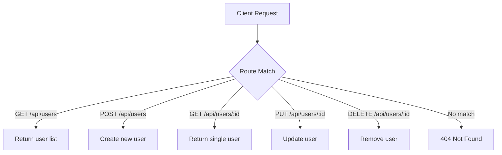

# T22: API Endpoints

An API (Application Programming Interface) is a set of endpoints your server exposes for clients to interact with data. REST is a design convention where URLs represent resources and HTTP methods represent actions. Think of it as a menu at a restaurant - the menu lists what you can order and how. {.lesson-intro}

## REST Conventions

RESTful APIs follow a pattern: resources are nouns in the URL, actions are HTTP methods.

```
// GET    /api/users      - List all users
// GET    /api/users/1    - Get user with id 1
// POST   /api/users      - Create a new user
// PUT    /api/users/1    - Update user 1
// DELETE /api/users/1    - Delete user 1
```

## Building Endpoints

```
const server = http.createServer((req, res) => {
    const url = req.url;
    const method = req.method;

    res.setHeader("Content-Type", "application/json");

    if (url === "/api/users" && method === "GET") {
        res.end(JSON.stringify(users));
    } else if (url === "/api/users" && method === "POST") {
        let body = "";
        req.on("data", chunk => body += chunk);
        req.on("end", () => {
            const user = JSON.parse(body);
            users.push(user);
            res.writeHead(201);
            res.end(JSON.stringify(user));
        });
    } else {
        res.writeHead(404);
        res.end(JSON.stringify({ error: "Not Found" }));
    }
});
```



<div class="takeaways">
<h2>Key Takeaways</h2>
<ul>
<li>REST uses URLs as resource identifiers and HTTP methods as actions</li>
<li>GET reads, POST creates, PUT updates, DELETE removes</li>
<li>API responses should be JSON with appropriate status codes</li>
<li>Always handle unknown routes with a 404 response</li>
</ul>
</div>
