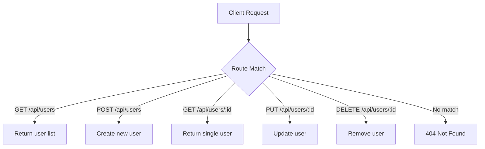

# T22: Endpoints de API

Uma API (Application Programming Interface) é um conjunto de endpoints que seu servidor expõe para clientes interagirem com os dados. REST é uma convenção de design onde URLs representam recursos e métodos HTTP representam ações. Pense nisso como o cardápio de um restaurante - o cardápio lista o que você pode pedir e como.
{: .lesson-intro }

## Convenções REST

APIs RESTful seguem um padrão: recursos são substantivos na URL, ações são métodos HTTP.

```
// GET    /api/users      - List all users
// GET    /api/users/1    - Get user with id 1
// POST   /api/users      - Create a new user
// PUT    /api/users/1    - Update user 1
// DELETE /api/users/1    - Delete user 1
```

## Construindo Endpoints

```
const server = http.createServer((req, res) => {
    const url = req.url;
    const method = req.method;

    res.setHeader("Content-Type", "application/json");

    if (url === "/api/users" && method === "GET") {
        res.end(JSON.stringify(users));
    } else if (url === "/api/users" && method === "POST") {
        let body = "";
        req.on("data", chunk => body += chunk);
        req.on("end", () => {
            const user = JSON.parse(body);
            users.push(user);
            res.writeHead(201);
            res.end(JSON.stringify(user));
        });
    } else {
        res.writeHead(404);
        res.end(JSON.stringify({ error: "Not Found" }));
    }
});
```



<div class="takeaways">
<h2>Key Takeaways</h2>
<ul>
<li>REST usa URLs como identificadores de recurso e métodos HTTP como ações</li>
<li>GET lê, POST cria, PUT atualiza, DELETE remove</li>
<li>Respostas de API devem ser JSON com códigos de status apropriados</li>
<li>Sempre trate rotas desconhecidas com resposta 404</li>
</ul>
</div>
