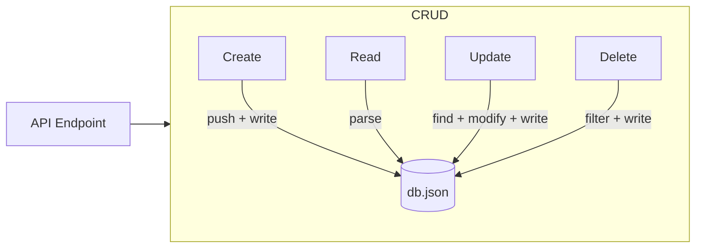

# T23: JSONデータベース

本格的なデータベースを学ぶ前に、JSONファイルをシンプルなデータストアとして使えます。ファイルを読み取り、パースし、データを変更し、書き戻します。エントリを書いたり消したりするノートのようなものです。シンプルですが小さなアプリケーションには効果的です。
{: .lesson-intro }

## db.jsonの読み書き

```
const fs = require("fs");
const DB_PATH = "./db.json";

function readDB() {
    const raw = fs.readFileSync(DB_PATH, "utf-8");
    return JSON.parse(raw);
}

function writeDB(data) {
    fs.writeFileSync(DB_PATH, JSON.stringify(data, null, 2));
}
```

## CRUD操作

```
// Create
function addUser(user) {
    const db = readDB();
    user.id = Date.now();
    db.users.push(user);
    writeDB(db);
    return user;
}

// Read
function getUsers() { return readDB().users; }

// Update
function updateUser(id, updates) {
    const db = readDB();
    const index = db.users.findIndex(u => u.id === id);
    if (index === -1) return null;
    db.users[index] = { ...db.users[index], ...updates };
    writeDB(db);
    return db.users[index];
}

// Delete
function deleteUser(id) {
    const db = readDB();
    db.users = db.users.filter(u => u.id !== id);
    writeDB(db);
}
```



<div class="takeaways">
<h2>まとめ</h2>
<ul>
<li>JSONファイルは小さなプロジェクトのシンプルなデータベースとして機能します</li>
<li>CRUDはCreate、Read、Update、Deleteの4つの基本データ操作の略です</li>
<li>常にファイル全体を読み取り、メモリ上で変更してから書き戻します</li>
<li>JSONデータベースはスケールしません。本番では本格的なDBを使いましょう</li>
</ul>
</div>
