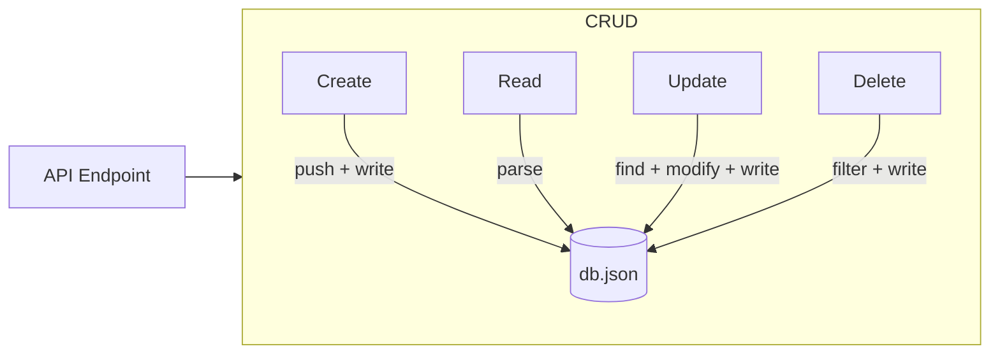

# T23: JSON Database

Before learning a real database, you can use a JSON file as a simple data store. Read the file, parse it, modify the data, and write it back. It is like a notebook where you write down and cross out entries - simple but effective for small applications. {.lesson-intro}

## Reading and Writing db.json

```
const fs = require("fs");
const DB_PATH = "./db.json";

function readDB() {
    const raw = fs.readFileSync(DB_PATH, "utf-8");
    return JSON.parse(raw);
}

function writeDB(data) {
    fs.writeFileSync(DB_PATH, JSON.stringify(data, null, 2));
}
```

## CRUD Operations

```
// Create
function addUser(user) {
    const db = readDB();
    user.id = Date.now();
    db.users.push(user);
    writeDB(db);
    return user;
}

// Read
function getUsers() { return readDB().users; }

// Update
function updateUser(id, updates) {
    const db = readDB();
    const index = db.users.findIndex(u => u.id === id);
    if (index === -1) return null;
    db.users[index] = { ...db.users[index], ...updates };
    writeDB(db);
    return db.users[index];
}

// Delete
function deleteUser(id) {
    const db = readDB();
    db.users = db.users.filter(u => u.id !== id);
    writeDB(db);
}
```



<div class="takeaways">
<h2>Key Takeaways</h2>
<ul>
<li>A JSON file can serve as a simple database for small projects</li>
<li>CRUD stands for Create, Read, Update, Delete - the four basic data operations</li>
<li>Always read the full file, modify in memory, then write back</li>
<li>JSON databases do not scale - use a real database for production</li>
</ul>
</div>
