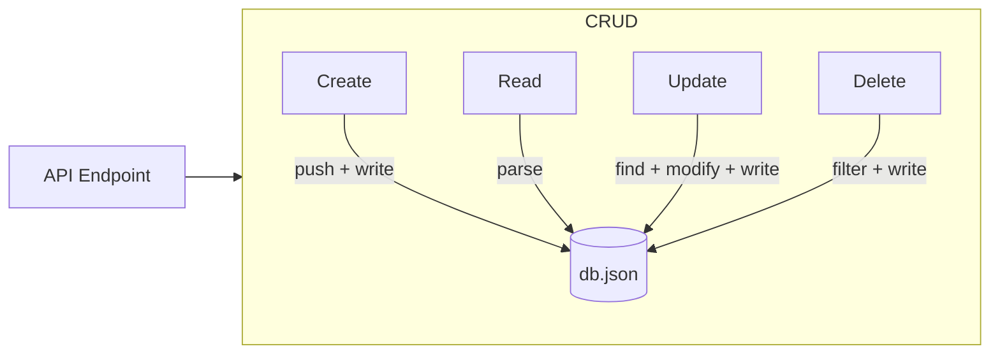

# T23: Banco JSON

Antes de aprender um banco de verdade, você pode usar um arquivo JSON como armazenamento simples. Leia o arquivo, parseie, modifique os dados e escreva de volta. É como um caderno onde você anota e risca entradas - simples mas eficaz para aplicações pequenas.
{: .lesson-intro }

## Lendo e Escrevendo db.json

```
const fs = require("fs");
const DB_PATH = "./db.json";

function readDB() {
    const raw = fs.readFileSync(DB_PATH, "utf-8");
    return JSON.parse(raw);
}

function writeDB(data) {
    fs.writeFileSync(DB_PATH, JSON.stringify(data, null, 2));
}
```

## Operações CRUD

```
// Create
function addUser(user) {
    const db = readDB();
    user.id = Date.now();
    db.users.push(user);
    writeDB(db);
    return user;
}

// Read
function getUsers() { return readDB().users; }

// Update
function updateUser(id, updates) {
    const db = readDB();
    const index = db.users.findIndex(u => u.id === id);
    if (index === -1) return null;
    db.users[index] = { ...db.users[index], ...updates };
    writeDB(db);
    return db.users[index];
}

// Delete
function deleteUser(id) {
    const db = readDB();
    db.users = db.users.filter(u => u.id !== id);
    writeDB(db);
}
```



<div class="takeaways">
<h2>Pontos-chave</h2>
<ul>
<li>Um arquivo JSON pode servir como banco simples para projetos pequenos</li>
<li>CRUD significa Create, Read, Update, Delete - as quatro operações básicas de dados</li>
<li>Sempre leia o arquivo inteiro, modifique em memória, depois escreva de volta</li>
<li>Bancos JSON não escalam - use um banco de verdade em produção</li>
</ul>
</div>
