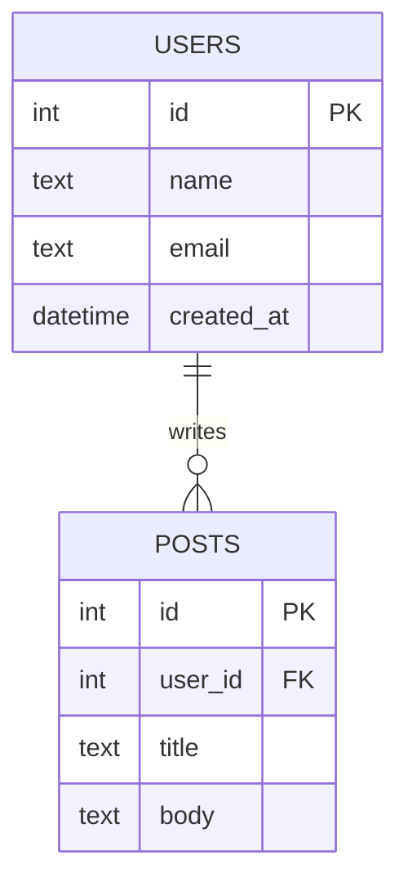

# T24: SQLite

SQLiteは単一ファイルにデータを格納する本格的なデータベースエンジンです。SQL(構造化問合せ言語)はそれと対話する言語です。JSONファイルがノートなら、SQLiteはラベル、カテゴリ、相互参照を備えた適切なファイルキャビネットです。同時アクセスとデータ整合性を自動的に処理します。
{: .lesson-intro }

## テーブルの作成

```
CREATE TABLE users (
    id INTEGER PRIMARY KEY AUTOINCREMENT,
    name TEXT NOT NULL,
    email TEXT UNIQUE NOT NULL,
    created_at DATETIME DEFAULT CURRENT_TIMESTAMP
);

CREATE TABLE posts (
    id INTEGER PRIMARY KEY AUTOINCREMENT,
    user_id INTEGER NOT NULL,
    title TEXT NOT NULL,
    body TEXT,
    FOREIGN KEY (user_id) REFERENCES users(id)
);
```

## SQLによるCRUD

```
-- Create
INSERT INTO users (name, email) VALUES ('Alice', 'alice@example.com');

-- Read
SELECT * FROM users WHERE name = 'Alice';
SELECT u.name, p.title FROM users u JOIN posts p ON u.id = p.user_id;

-- Update
UPDATE users SET name = 'Bob' WHERE id = 1;

-- Delete
DELETE FROM users WHERE id = 1;
```

## Node.jsでのSQLite使用

```
const Database = require("better-sqlite3");
const db = new Database("app.db");

const users = db.prepare("SELECT * FROM users").all();
db.prepare("INSERT INTO users (name, email) VALUES (?, ?)").run("Alice", "a@b.com");
```



<div class="takeaways">
<h2>まとめ</h2>
<ul>
<li>SQLiteは単一ファイルに完全なリレーショナルデータベースを格納します</li>
<li>SQLはSELECT、JOIN、WHEREなどで強力なクエリを提供します</li>
<li>外部キーはテーブル間の関係を作りデータ整合性を強制します</li>
<li>SQLインジェクション攻撃を防ぐためパラメータ化クエリ(?)を使いましょう</li>
</ul>
</div>
