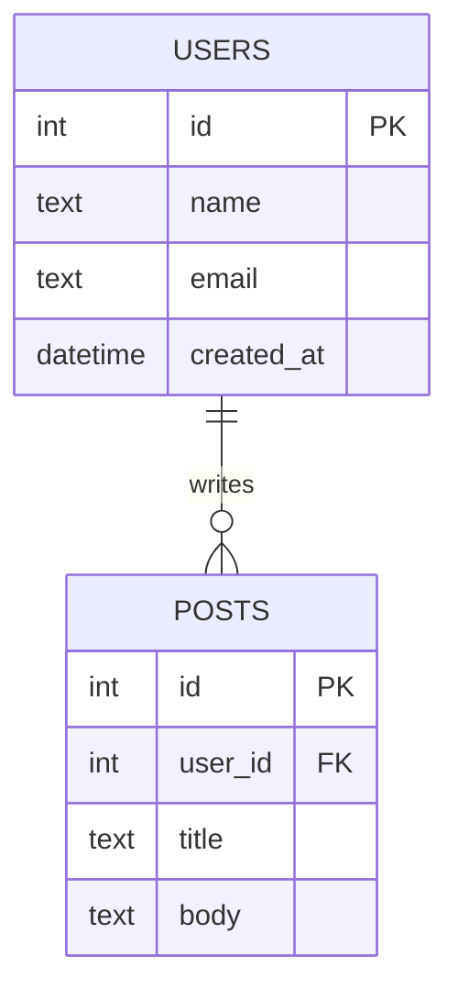

# T24: SQLite

SQLite is a real database engine that stores data in a single file. SQL (Structured Query Language) is the language you use to talk to it. If a JSON file is a notebook, SQLite is a proper filing cabinet with labels, categories, and cross-references. It handles concurrent access and data integrity for you.
{: .lesson-intro }

## Creating Tables

```
CREATE TABLE users (
    id INTEGER PRIMARY KEY AUTOINCREMENT,
    name TEXT NOT NULL,
    email TEXT UNIQUE NOT NULL,
    created_at DATETIME DEFAULT CURRENT_TIMESTAMP
);

CREATE TABLE posts (
    id INTEGER PRIMARY KEY AUTOINCREMENT,
    user_id INTEGER NOT NULL,
    title TEXT NOT NULL,
    body TEXT,
    FOREIGN KEY (user_id) REFERENCES users(id)
);
```

## CRUD with SQL

```
-- Create
INSERT INTO users (name, email) VALUES ('Alice', 'alice@example.com');

-- Read
SELECT * FROM users WHERE name = 'Alice';
SELECT u.name, p.title FROM users u JOIN posts p ON u.id = p.user_id;

-- Update
UPDATE users SET name = 'Bob' WHERE id = 1;

-- Delete
DELETE FROM users WHERE id = 1;
```

## Using SQLite in Node.js

```
const Database = require("better-sqlite3");
const db = new Database("app.db");

const users = db.prepare("SELECT * FROM users").all();
db.prepare("INSERT INTO users (name, email) VALUES (?, ?)").run("Alice", "a@b.com");
```



<div class="takeaways">
<h2>Key Takeaways</h2>
<ul>
<li>SQLite stores a full relational database in a single file</li>
<li>SQL provides powerful querying with SELECT, JOIN, WHERE, and more</li>
<li>Foreign keys create relationships between tables and enforce data integrity</li>
<li>Use parameterized queries (?) to prevent SQL injection attacks</li>
</ul>
</div>
