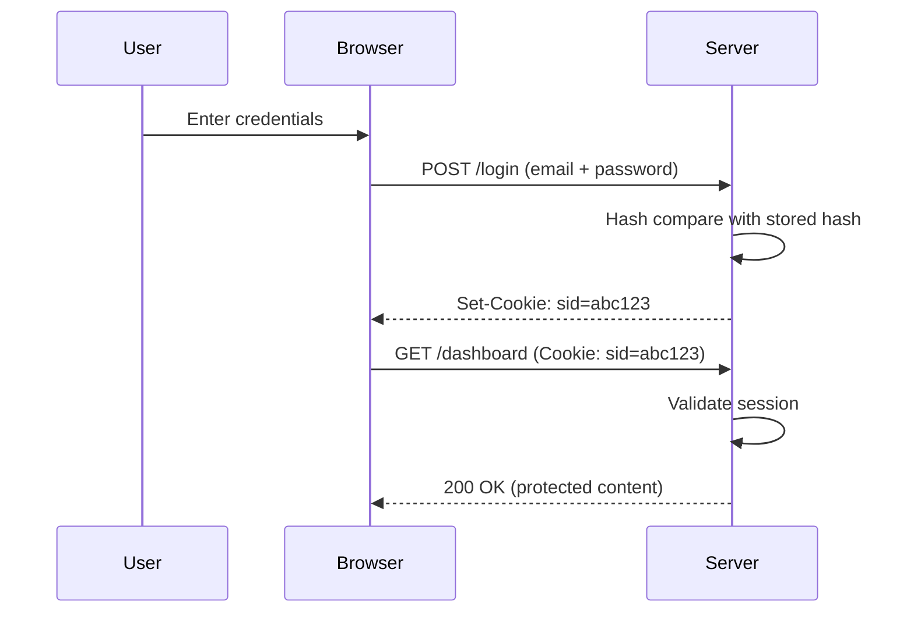

# T25: 認証

認証は「あなたは誰ですか?」という質問に答えます。クラブの入口でIDをチェックするドアマンのようなものです。セッション、Cookie、パスワードハッシュが連携してユーザーを安全に検証します。これを間違えるとユーザーを危険にさらすことになります。 {.lesson-intro}

## パスワードハッシュ

パスワードを平文で保存してはいけません。bcryptのような強力なアルゴリズムでハッシュします。ハッシュは一方向関数です。パスワードを照合できますが、元に戻すことはできません。

```
const bcrypt = require("bcrypt");

// Hash a password
const hash = await bcrypt.hash("userPassword123", 10);

// Verify a password
const match = await bcrypt.compare("userPassword123", hash);
if (match) { console.log("Access granted"); }
```

## セッションとCookie

ログイン後、サーバーはセッションを作成しCookieでセッションIDを送信します。ブラウザはその後の全リクエストでこのCookieを送信して身元を証明します。

```
// On login success
const sessionId = crypto.randomUUID();
sessions[sessionId] = { userId: user.id, createdAt: Date.now() };
res.setHeader("Set-Cookie", `sid=${sessionId}; HttpOnly; Path=/`);

// On each request
function authenticate(req) {
    const cookie = parseCookies(req.headers.cookie);
    return sessions[cookie.sid] || null;
}
```



<div class="takeaways">
<h2>まとめ</h2>
<ul>
<li>平文パスワードは絶対に保存しない。必ずbcryptなどでハッシュします</li>
<li>セッションはCookieに保存された一意のセッションIDでログインユーザーを追跡します</li>
<li>HttpOnly Cookieを使ってJavaScriptがセッショントークンを読めないようにします</li>
<li>認証は身元確認、認可はアクセスできる範囲を制御します</li>
</ul>
</div>
