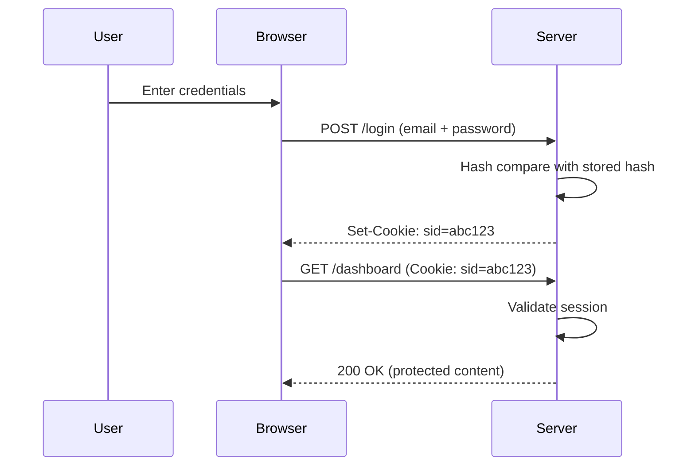

# T25: Authentication

Authentication answers the question "who are you?" It is like a bouncer at a club checking IDs. Sessions, cookies, and password hashing work together to verify users securely. Get this wrong, and you expose your users to real harm. {.lesson-intro}

## Password Hashing

Never store passwords in plain text. Hash them with a strong algorithm like bcrypt. A hash is a one-way function - you can verify a password against it but cannot reverse it.

```
const bcrypt = require("bcrypt");

// Hash a password
const hash = await bcrypt.hash("userPassword123", 10);

// Verify a password
const match = await bcrypt.compare("userPassword123", hash);
if (match) { console.log("Access granted"); }
```

## Sessions and Cookies

After login, the server creates a session and sends a session ID via a cookie. The browser sends this cookie with every subsequent request to prove identity.

```
// On login success
const sessionId = crypto.randomUUID();
sessions[sessionId] = { userId: user.id, createdAt: Date.now() };
res.setHeader("Set-Cookie", `sid=${sessionId}; HttpOnly; Path=/`);

// On each request
function authenticate(req) {
    const cookie = parseCookies(req.headers.cookie);
    return sessions[cookie.sid] || null;
}
```



<div class="takeaways">
<h2>Key Takeaways</h2>
<ul>
<li>Never store plain text passwords - always hash with bcrypt or similar</li>
<li>Sessions track logged-in users via a unique session ID stored in a cookie</li>
<li>Use HttpOnly cookies to prevent JavaScript from reading session tokens</li>
<li>Authentication verifies identity, authorization controls what they can access</li>
</ul>
</div>
