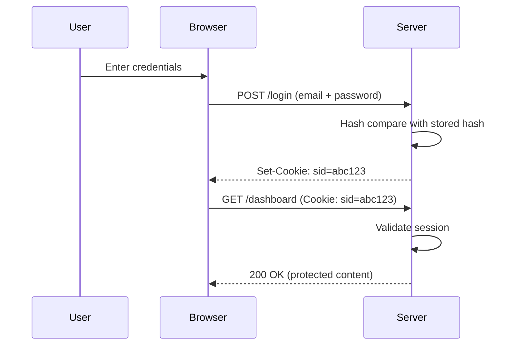

# T25: Autenticação

Autenticação responde à pergunta "quem é você?". É como um segurança numa balada conferindo a identidade. Sessões, cookies e hashing de senha trabalham juntos para verificar usuários com segurança. Errar aqui expõe seus usuários a danos reais.
{: .lesson-intro }

## Hashing de Senha

Nunca guarde senhas em texto puro. Faça hash com um algoritmo forte como bcrypt. Um hash é uma função de mão única - você pode verificar uma senha contra ele mas não consegue reverter.

```
const bcrypt = require("bcrypt");

// Hash a password
const hash = await bcrypt.hash("userPassword123", 10);

// Verify a password
const match = await bcrypt.compare("userPassword123", hash);
if (match) { console.log("Access granted"); }
```

## Sessões e Cookies

Depois do login, o servidor cria uma sessão e envia um ID de sessão via cookie. O navegador envia esse cookie a cada requisição seguinte para provar identidade.

```
// On login success
const sessionId = crypto.randomUUID();
sessions[sessionId] = { userId: user.id, createdAt: Date.now() };
res.setHeader("Set-Cookie", `sid=${sessionId}; HttpOnly; Path=/`);

// On each request
function authenticate(req) {
    const cookie = parseCookies(req.headers.cookie);
    return sessions[cookie.sid] || null;
}
```



<div class="takeaways">
<h2>Key Takeaways</h2>
<ul>
<li>Nunca armazene senhas em texto puro - sempre use hash com bcrypt ou similar</li>
<li>Sessões rastreiam usuários logados via um ID único de sessão guardado em um cookie</li>
<li>Use cookies HttpOnly para impedir que JavaScript leia tokens de sessão</li>
<li>Autenticação verifica identidade, autorização controla o que a pessoa pode acessar</li>
</ul>
</div>
