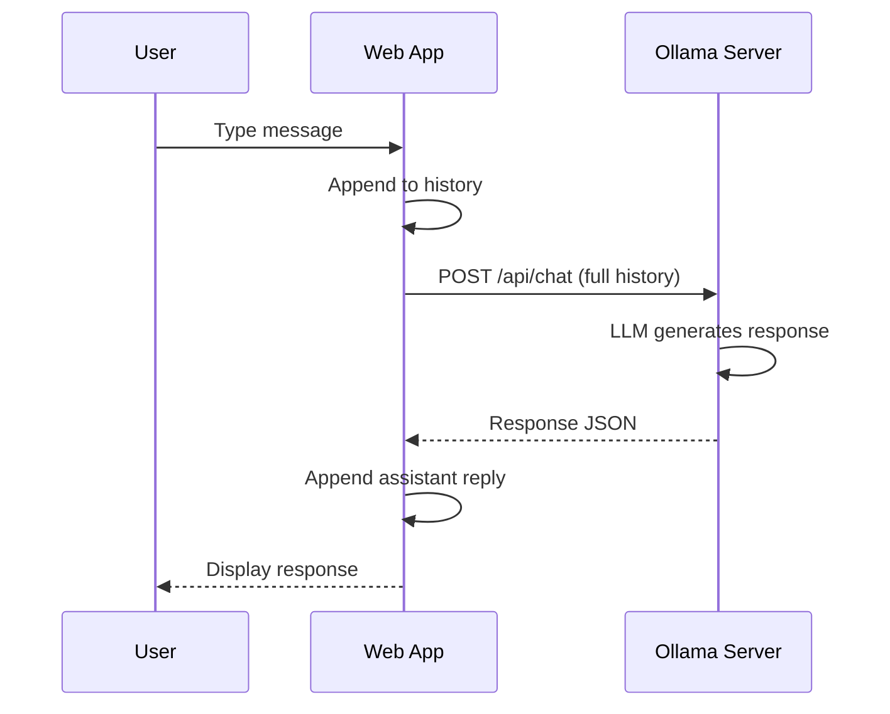

# T26: OllamaとChat

大規模言語モデル(LLM)はローカルマシンで動作できるようになりました。Ollamaはオープンソースモデルのダウンロードと配信を簡単にします。WebアプリをローカルLLMに接続すれば、外部サービスにデータを送らずにAI機能を実現できます。自分のコンピュータに住む賢いアシスタントを持つようなものです。
{: .lesson-intro }

## Ollamaのセットアップ

Ollamaをインストールし、モデルをプルすると、localhost:11434でAPIが提供されます。

```
# Install and run
# ollama pull llama3
# ollama serve

# The API is now available at http://localhost:11434
```

## Chat API統合

```
async function chat(messages) {
    const response = await fetch("http://localhost:11434/api/chat", {
        method: "POST",
        headers: { "Content-Type": "application/json" },
        body: JSON.stringify({
            model: "llama3",
            messages: messages,
            stream: false
        })
    });
    const data = await response.json();
    return data.message.content;
}

// Usage
const reply = await chat([
    { role: "system", content: "You are a helpful assistant." },
    { role: "user", content: "Explain HTML in one sentence." }
]);
```

## チャットインターフェースの構築

会話履歴をメッセージオブジェクトの配列として保存します。新しいメッセージを追加し、コンテキスト維持のために完全な履歴を送信します。



<div class="takeaways">
<h2>まとめ</h2>
<ul>
<li>OllamaはシンプルなAPIでオープンソースのLLMをローカル実行します</li>
<li>Chat APIはroleとcontentフィールドを持つメッセージの配列を受け取ります</li>
<li>コンテキストを考慮したレスポンスのために完全な会話履歴を送信します</li>
<li>ローカルLLMはデータを非公開に保ちます。外部API呼び出し不要です</li>
</ul>
</div>
