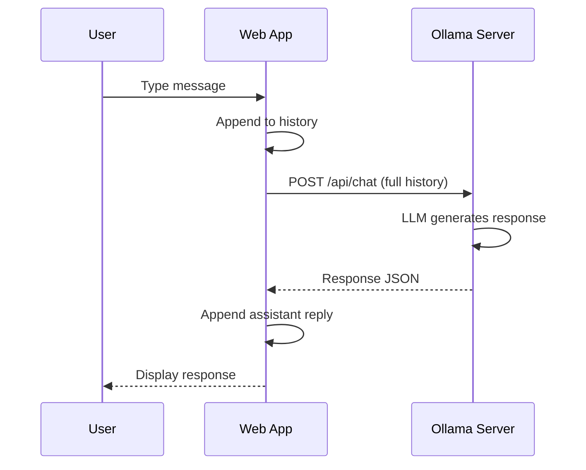

# T26: Ollama and Chat

Large Language Models (LLMs) can now run locally on your machine. Ollama makes it easy to download and serve open-source models. Connecting your web app to a local LLM gives you AI-powered features without sending data to external services - like having a smart assistant living on your own computer.
{: .lesson-intro }

## Setting Up Ollama

Install Ollama, pull a model, and it serves an API on localhost:11434.

```
# Install and run
# ollama pull llama3
# ollama serve

# The API is now available at http://localhost:11434
```

## Chat API Integration

```
async function chat(messages) {
    const response = await fetch("http://localhost:11434/api/chat", {
        method: "POST",
        headers: { "Content-Type": "application/json" },
        body: JSON.stringify({
            model: "llama3",
            messages: messages,
            stream: false
        })
    });
    const data = await response.json();
    return data.message.content;
}

// Usage
const reply = await chat([
    { role: "system", content: "You are a helpful assistant." },
    { role: "user", content: "Explain HTML in one sentence." }
]);
```

## Building a Chat Interface

Store the conversation history as an array of message objects. Append each new message and send the full history to maintain context.



<div class="takeaways">
<h2>Key Takeaways</h2>
<ul>
<li>Ollama runs open-source LLMs locally with a simple API</li>
<li>The chat API takes an array of messages with role and content fields</li>
<li>Send the full conversation history for context-aware responses</li>
<li>Local LLMs keep your data private - no external API calls needed</li>
</ul>
</div>
