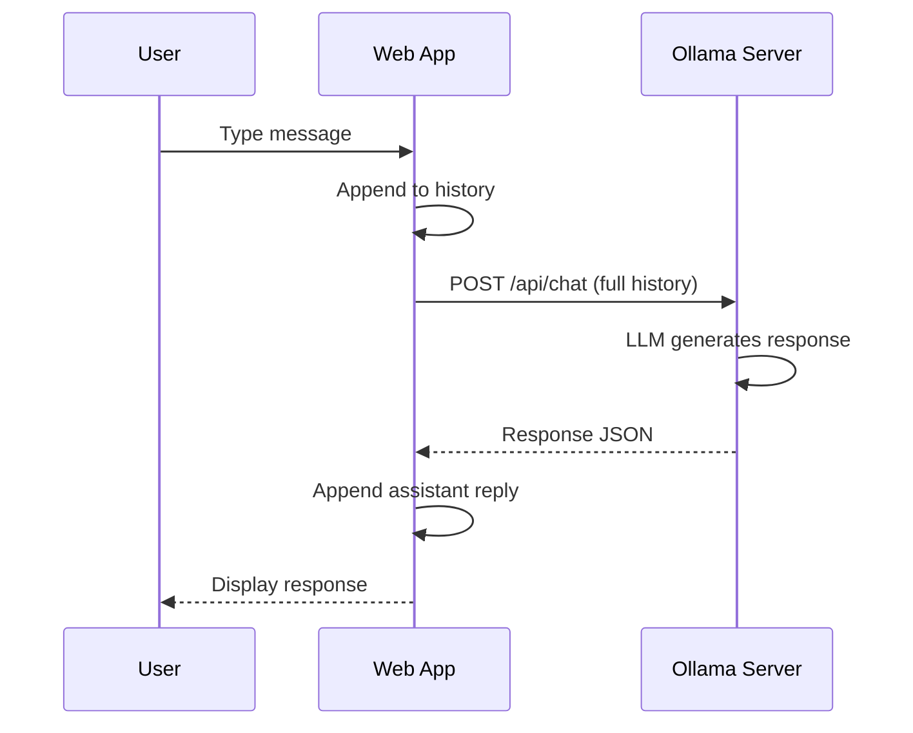

# T26: Ollama e Chat

Modelos de linguagem grandes (LLMs) hoje rodam localmente na sua máquina. O Ollama facilita baixar e servir modelos open source. Conectar seu web app a um LLM local te dá features com IA sem enviar dados para serviços externos - como ter um assistente esperto morando no seu próprio computador.
{: .lesson-intro }

## Configurando o Ollama

Instale o Ollama, puxe um modelo e ele serve uma API em localhost:11434.

```
# Install and run
# ollama pull llama3
# ollama serve

# The API is now available at http://localhost:11434
```

## Integração com a API de Chat

```
async function chat(messages) {
    const response = await fetch("http://localhost:11434/api/chat", {
        method: "POST",
        headers: { "Content-Type": "application/json" },
        body: JSON.stringify({
            model: "llama3",
            messages: messages,
            stream: false
        })
    });
    const data = await response.json();
    return data.message.content;
}

// Usage
const reply = await chat([
    { role: "system", content: "You are a helpful assistant." },
    { role: "user", content: "Explain HTML in one sentence." }
]);
```

## Construindo uma Interface de Chat

Guarde o histórico da conversa como um array de objetos de mensagem. Anexe cada nova mensagem e envie o histórico completo para manter o contexto.



<div class="takeaways">
<h2>Key Takeaways</h2>
<ul>
<li>Ollama roda LLMs open source localmente com uma API simples</li>
<li>A API de chat recebe um array de mensagens com campos role e content</li>
<li>Envie o histórico completo da conversa para respostas cientes do contexto</li>
<li>LLMs locais mantêm seus dados privados - sem chamadas a API externa</li>
</ul>
</div>
