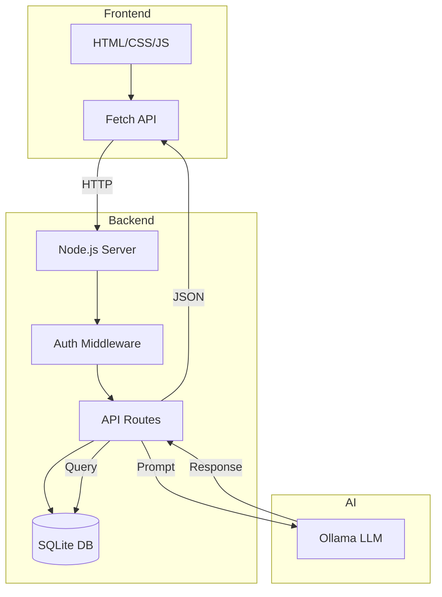

# T27: フルスタックAIアプリ

ここで全てが繋がります。フルスタックアプリケーションはフロントエンド(ユーザーが見るもの)、バックエンド(サーバーロジックとデータ)、AI層(インテリジェントな応答)を接続します。完全なレストランを建てるようなもので、ダイニング、キッチン、シェフが調和して動きます。
{: .lesson-intro }

## アーキテクチャ概要

フロントエンドはユーザー入力をNode.jsサーバーに送信します。サーバーはセッション管理、データ検証を行い、プロンプトをOllamaに転送します。レスポンスは同じ経路を通って戻ります。

## 層の接続

```
// Server: Bridge between frontend and AI
app.post("/api/chat", authenticate, async (req, res) => {
    const { message } = req.body;
    const userId = req.session.userId;

    // Save to database
    db.prepare("INSERT INTO messages (user_id, role, content) VALUES (?, ?, ?)")
      .run(userId, "user", message);

    // Get conversation history
    const history = db.prepare("SELECT role, content FROM messages WHERE user_id = ? ORDER BY id")
      .all(userId);

    // Call Ollama
    const aiResponse = await chat(history);

    // Save AI response
    db.prepare("INSERT INTO messages (user_id, role, content) VALUES (?, ?, ?)")
      .run(userId, "assistant", aiResponse);

    res.json({ reply: aiResponse });
});
```



<div class="takeaways">
<h2>まとめ</h2>
<ul>
<li>フルスタックアプリはフロントエンド、バックエンド、データ層を1つのシステムに接続します</li>
<li>サーバーはユーザーインターフェースとAIモデルの間の橋渡しをします</li>
<li>会話履歴をデータベースに保存してセッション間で永続化します</li>
<li>認証でAIエンドポイントを不正アクセスから保護します</li>
</ul>
</div>
