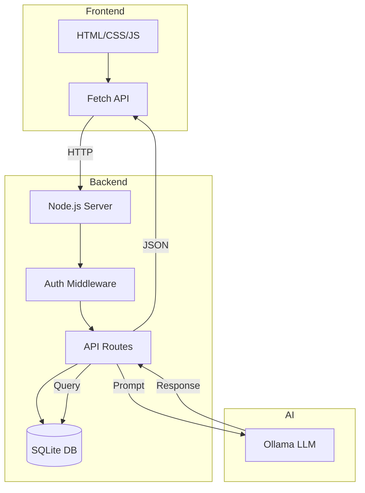

# T27: Full Stack AI App

This is where everything comes together. A full-stack application connects the frontend (what users see) to the backend (server logic and data) to the AI layer (intelligent responses). Think of it as building a complete restaurant - the dining room, the kitchen, and the chef all working in harmony.
{: .lesson-intro }

## Architecture Overview

The frontend sends user input to your Node.js server. The server manages sessions, validates data, and forwards prompts to Ollama. Responses flow back through the same chain.

## Connecting the Layers

```
// Server: Bridge between frontend and AI
app.post("/api/chat", authenticate, async (req, res) => {
    const { message } = req.body;
    const userId = req.session.userId;

    // Save to database
    db.prepare("INSERT INTO messages (user_id, role, content) VALUES (?, ?, ?)")
      .run(userId, "user", message);

    // Get conversation history
    const history = db.prepare("SELECT role, content FROM messages WHERE user_id = ? ORDER BY id")
      .all(userId);

    // Call Ollama
    const aiResponse = await chat(history);

    // Save AI response
    db.prepare("INSERT INTO messages (user_id, role, content) VALUES (?, ?, ?)")
      .run(userId, "assistant", aiResponse);

    res.json({ reply: aiResponse });
});
```



<div class="takeaways">
<h2>Key Takeaways</h2>
<ul>
<li>Full-stack apps connect frontend, backend, and data layers into one system</li>
<li>The server acts as a bridge between the user interface and AI model</li>
<li>Store conversation history in a database for persistence across sessions</li>
<li>Authentication protects AI endpoints from unauthorized access</li>
</ul>
</div>
