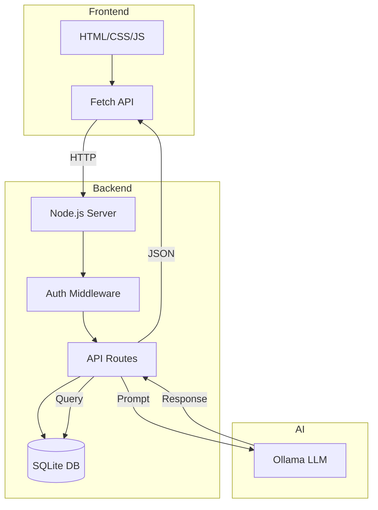

# T27: App Full Stack com IA

É aqui que tudo se junta. Uma aplicação full stack conecta o frontend (o que os usuários veem) ao backend (lógica do servidor e dados) à camada de IA (respostas inteligentes). Pense em construir um restaurante completo - o salão, a cozinha e o chef trabalhando em harmonia.
{: .lesson-intro }

## Visão Geral da Arquitetura

O frontend envia a entrada do usuário para o seu servidor Node.js. O servidor gerencia sessões, valida dados e encaminha prompts para o Ollama. As respostas voltam pela mesma cadeia.

## Conectando as Camadas

```
// Server: Bridge between frontend and AI
app.post("/api/chat", authenticate, async (req, res) => {
    const { message } = req.body;
    const userId = req.session.userId;

    // Save to database
    db.prepare("INSERT INTO messages (user_id, role, content) VALUES (?, ?, ?)")
      .run(userId, "user", message);

    // Get conversation history
    const history = db.prepare("SELECT role, content FROM messages WHERE user_id = ? ORDER BY id")
      .all(userId);

    // Call Ollama
    const aiResponse = await chat(history);

    // Save AI response
    db.prepare("INSERT INTO messages (user_id, role, content) VALUES (?, ?, ?)")
      .run(userId, "assistant", aiResponse);

    res.json({ reply: aiResponse });
});
```



<div class="takeaways">
<h2>Key Takeaways</h2>
<ul>
<li>Apps full stack conectam camadas de frontend, backend e dados num único sistema</li>
<li>O servidor age como ponte entre a interface do usuário e o modelo de IA</li>
<li>Armazene o histórico da conversa num banco para persistência entre sessões</li>
<li>Autenticação protege endpoints de IA contra acesso não autorizado</li>
</ul>
</div>
