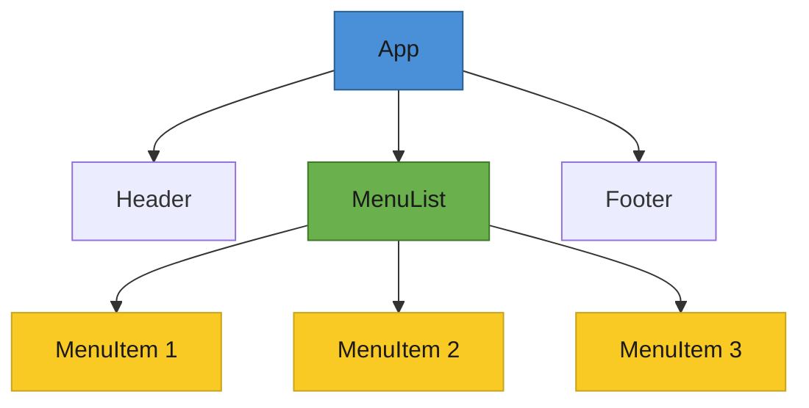

# T28: Reactの基礎

Reactはコンポーネントという再利用可能なパーツからUIを構築します。コンポーネントはレゴブロックのようなもので、自分で定義するカスタムHTMLタグです。ブラウザに一つずつ変更を指示する代わりに、画面がどう見えるべきかを記述すれば、Reactが更新を処理します。 {.lesson-intro}

## 命令型から宣言型へ

素のJavaScriptでは、要素を手動で探して更新します。Reactはこれを逆転させます。望ましいUIの状態を宣言すれば、ReactがDOM更新を処理します。

```
// Vanilla JS - imperative: you manage every step
const btn = document.getElementById("counter-btn");
let count = 0;
btn.addEventListener("click", () => {
    count++;
    btn.textContent = `Clicked ${count} times`;
});

// React - declarative: describe the result, React updates the DOM
function Counter() {
    const [count, setCount] = React.useState(0);
    return (
        <button onClick={() => setCount(count + 1)}>
            Clicked {count} times
        </button>
    );
}
```

## コンポーネント、JSX、Props

コンポーネントはJSXを返す関数です。JSXはHTMLに似た構文ですがJavaScriptの中に存在します。Propsは親から子に渡される入力で、関数の引数のようなものです。

```
function MenuItem({ name, price }) {
    return (
        <div className="menu-item">
            <span>{name}</span>
            <span>${price}</span>
        </div>
    );
}

// Rendering a list with .map() and keys
function MenuList({ items }) {
    return (
        <ul>
            {items.map(item => (
                <MenuItem key={item.id} name={item.name} price={item.price} />
            ))}
        </ul>
    );
}
```

## イベント処理

Reactは`onClick`や`onChange`のようなキャメルケースのイベントハンドラをJSX要素に直接使用します。ハンドラはブラウザ間で一貫して動作する合成イベントオブジェクトを受け取ります。



<div class="takeaways">
<h2>まとめ</h2>
<ul>
<li>コンポーネントはJSXを返す再利用可能な関数で、カスタムHTMLタグのようなもの</li>
<li>Reactは宣言型 - UIがどう見えるべきかを記述し、更新方法は記述しない</li>
<li>Propsは親から子コンポーネントにデータを渡し、設定可能にする</li>
<li>.map()でリストをレンダリングする際は必ず一意のkeyプロパティを指定する</li>
</ul>
</div>
