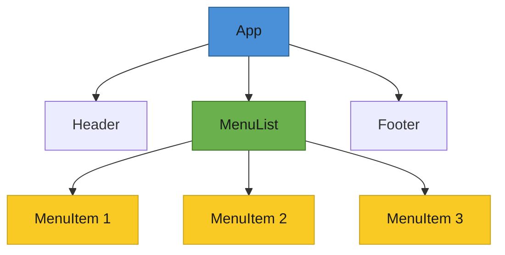

# T28: React Foundations

React lets you build UIs from reusable pieces called components. Think of components as Lego bricks - custom HTML tags you define yourself. Instead of telling the browser step-by-step what to change, you describe what the screen should look like, and React figures out the updates.
{: .lesson-intro }

## From Imperative to Declarative

With vanilla JavaScript, you manually find elements and update them. React flips this: you declare the desired UI state, and React handles the DOM updates for you.

```
// Vanilla JS - imperative: you manage every step
const btn = document.getElementById("counter-btn");
let count = 0;
btn.addEventListener("click", () => {
    count++;
    btn.textContent = `Clicked ${count} times`;
});

// React - declarative: describe the result, React updates the DOM
function Counter() {
    const [count, setCount] = React.useState(0);
    return (
        <button onClick={() => setCount(count + 1)}>
            Clicked {count} times
        </button>
    );
}
```

## Components, JSX, and Props

A component is a function that returns JSX - a syntax that looks like HTML but lives inside JavaScript. Props are inputs passed from parent to child, like function arguments.

```
function MenuItem({ name, price }) {
    return (
        <div className="menu-item">
            <span>{name}</span>
            <span>${price}</span>
        </div>
    );
}

// Rendering a list with .map() and keys
function MenuList({ items }) {
    return (
        <ul>
            {items.map(item => (
                <MenuItem key={item.id} name={item.name} price={item.price} />
            ))}
        </ul>
    );
}
```

## Handling Events

React uses camelCase event handlers like `onClick` and `onChange` directly on JSX elements. The handler receives a synthetic event object that works consistently across browsers.



<div class="takeaways">
<h2>Key Takeaways</h2>
<ul>
<li>Components are reusable functions that return JSX, like custom HTML tags</li>
<li>React is declarative - describe what the UI should look like, not how to update it</li>
<li>Props pass data from parent to child components, making them configurable</li>
<li>Always provide a unique key prop when rendering lists with .map()</li>
</ul>
</div>
