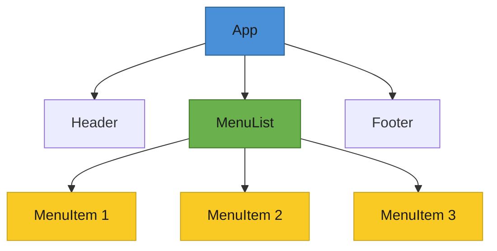

# T28: Fundamentos de React

O React permite construir UIs a partir de pedaços reutilizáveis chamados componentes. Pense em componentes como peças de Lego - tags HTML customizadas que você mesmo define. Em vez de dizer ao navegador passo a passo o que mudar, você descreve como a tela deve parecer, e o React descobre as atualizações.
{: .lesson-intro }

## Do Imperativo ao Declarativo

Com JavaScript puro, você encontra elementos e os atualiza manualmente. O React inverte isso: você declara o estado desejado da UI, e o React cuida das atualizações do DOM por você.

```
// Vanilla JS - imperative: you manage every step
const btn = document.getElementById("counter-btn");
let count = 0;
btn.addEventListener("click", () => {
    count++;
    btn.textContent = `Clicked ${count} times`;
});

// React - declarative: describe the result, React updates the DOM
function Counter() {
    const [count, setCount] = React.useState(0);
    return (
        <button onClick={() => setCount(count + 1)}>
            Clicked {count} times
        </button>
    );
}
```

## Componentes, JSX e Props

Um componente é uma função que retorna JSX - uma sintaxe que parece HTML mas vive dentro do JavaScript. Props são entradas passadas do pai para o filho, como argumentos de função.

```
function MenuItem({ name, price }) {
    return (
        <div className="menu-item">
            <span>{name}</span>
            <span>${price}</span>
        </div>
    );
}

// Rendering a list with .map() and keys
function MenuList({ items }) {
    return (
        <ul>
            {items.map(item => (
                <MenuItem key={item.id} name={item.name} price={item.price} />
            ))}
        </ul>
    );
}
```

## Tratando Eventos

O React usa handlers de evento em camelCase como `onClick` e `onChange` diretamente nos elementos JSX. O handler recebe um objeto de evento sintético que funciona de forma consistente em todos os navegadores.



<div class="takeaways">
<h2>Pontos-chave</h2>
<ul>
<li>Componentes são funções reutilizáveis que retornam JSX, como tags HTML customizadas</li>
<li>React é declarativo - descreva como a UI deve parecer, não como atualizá-la</li>
<li>Props passam dados do pai para componentes filhos, tornando-os configuráveis</li>
<li>Sempre forneça uma prop key única ao renderizar listas com .map()</li>
</ul>
</div>
