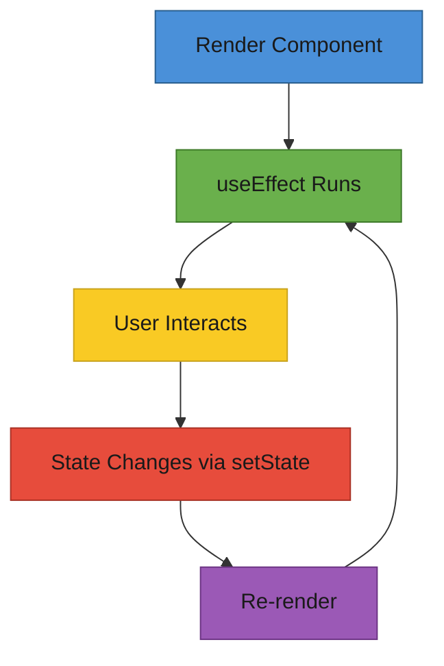

# T29: Reactのステートとエフェクト

ステートはコンポーネントの個人的なノートです。レンダリング間で保持され、更新時に再レンダリングを引き起こすプライベートデータです。エフェクトはコンポーネントのレンダリング後に鳴る目覚まし時計のようなもので、APIやタイマーなどの外部システムと同期できます。 {.lesson-intro}

## useState: コンポーネントのメモリ

`useState`フックはコンポーネントに独自のメモリを与えます。現在の値とセッター関数を返します。セッターが呼ばれると、Reactは新しい値でコンポーネントを再レンダリングします。

```
import { useState } from "react";

function Counter() {
    const [count, setCount] = useState(0);

    return (
        <div>
            <p>Count: {count}</p>
            <button onClick={() => setCount(count + 1)}>+1</button>
            <button onClick={() => setCount(0)}>Reset</button>
        </div>
    );
}
```

## useEffect: 副作用

`useEffect`フックはレンダリング後にコードを実行します。依存配列が再実行のタイミングを制御します。空の配列は「マウント時に一度だけ実行」を意味します。変数を含めると「これらが変更されたら再実行」になります。

```
import { useState, useEffect } from "react";

function MenuPage() {
    const [items, setItems] = useState([]);
    const [loading, setLoading] = useState(true);

    useEffect(() => {
        fetch("/api/menu")
            .then(res => res.json())
            .then(data => {
                setItems(data);
                setLoading(false);
            });
    }, []); // Empty array = run once on mount

    if (loading) return <p>Loading...</p>;
    return <ul>{items.map(i => <li key={i.id}>{i.name}</li>)}</ul>;
}
```

## ステートのリフトアップ

2つの兄弟コンポーネントがデータを共有する必要がある場合、ステートを共通の親に移動します。親がステートを所有し、propsとして子に渡します。これがReactの主要なデータ共有パターンです。



<div class="takeaways">
<h2>まとめ</h2>
<ul>
<li>useStateはレンダリング間で保持されるメモリをコンポーネントに与える</li>
<li>useEffectはレンダリング後に副作用を実行し、依存配列で制御する</li>
<li>空の依存配列はエフェクトがマウント時に一度だけ実行されることを意味する</li>
<li>兄弟コンポーネントがデータを共有する場合、最も近い共通の親にステートをリフトアップする</li>
</ul>
</div>
