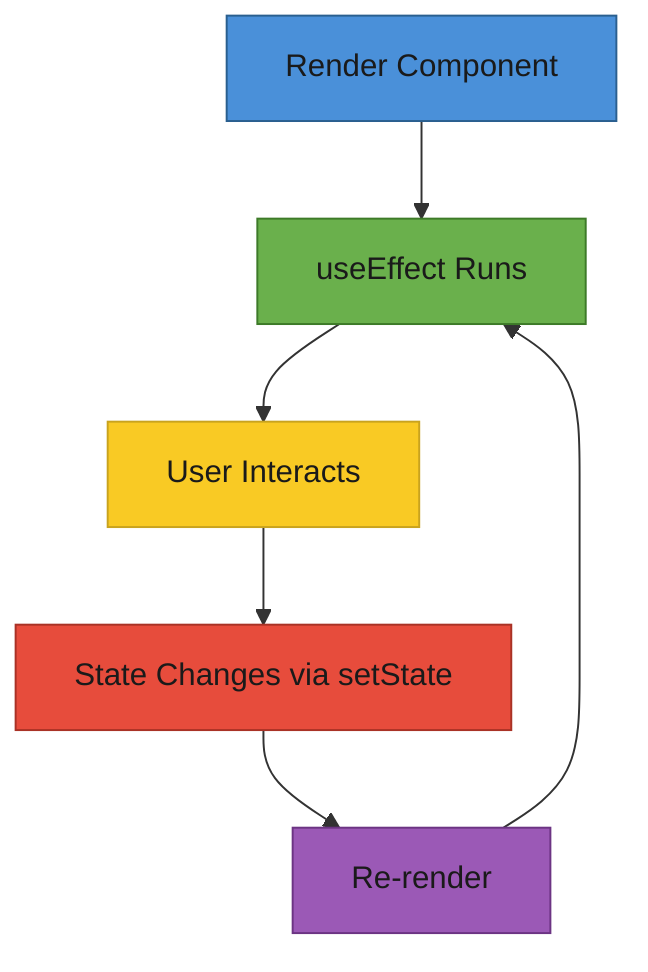

# T29: React State & Effects

State is a component's personal notebook - private data that persists across renders and triggers re-renders when updated. Effects are like alarm clocks that go off after the component renders, letting you synchronize with external systems like APIs or timers.
{: .lesson-intro }

## useState: Component Memory

The `useState` hook gives a component its own memory. It returns the current value and a setter function. When the setter is called, React re-renders the component with the new value.

```
import { useState } from "react";

function Counter() {
    const [count, setCount] = useState(0);

    return (
        <div>
            <p>Count: {count}</p>
            <button onClick={() => setCount(count + 1)}>+1</button>
            <button onClick={() => setCount(0)}>Reset</button>
        </div>
    );
}
```

## useEffect: Side Effects

The `useEffect` hook runs code after render. The dependency array controls when it re-runs. An empty array means "run once on mount." Including variables means "re-run when these change."

```
import { useState, useEffect } from "react";

function MenuPage() {
    const [items, setItems] = useState([]);
    const [loading, setLoading] = useState(true);

    useEffect(() => {
        fetch("/api/menu")
            .then(res => res.json())
            .then(data => {
                setItems(data);
                setLoading(false);
            });
    }, []); // Empty array = run once on mount

    if (loading) return <p>Loading...</p>;
    return <ul>{items.map(i => <li key={i.id}>{i.name}</li>)}</ul>;
}
```

## Lifting State Up

When two sibling components need to share data, move the state to their common parent. The parent owns the state and passes it down as props. This is React's primary data-sharing pattern.



<div class="takeaways">
<h2>Key Takeaways</h2>
<ul>
<li>useState gives components memory that persists across renders</li>
<li>useEffect runs side effects after render, controlled by the dependency array</li>
<li>An empty dependency array means the effect runs only once on mount</li>
<li>Lift state to the nearest common parent when siblings need to share data</li>
</ul>
</div>
