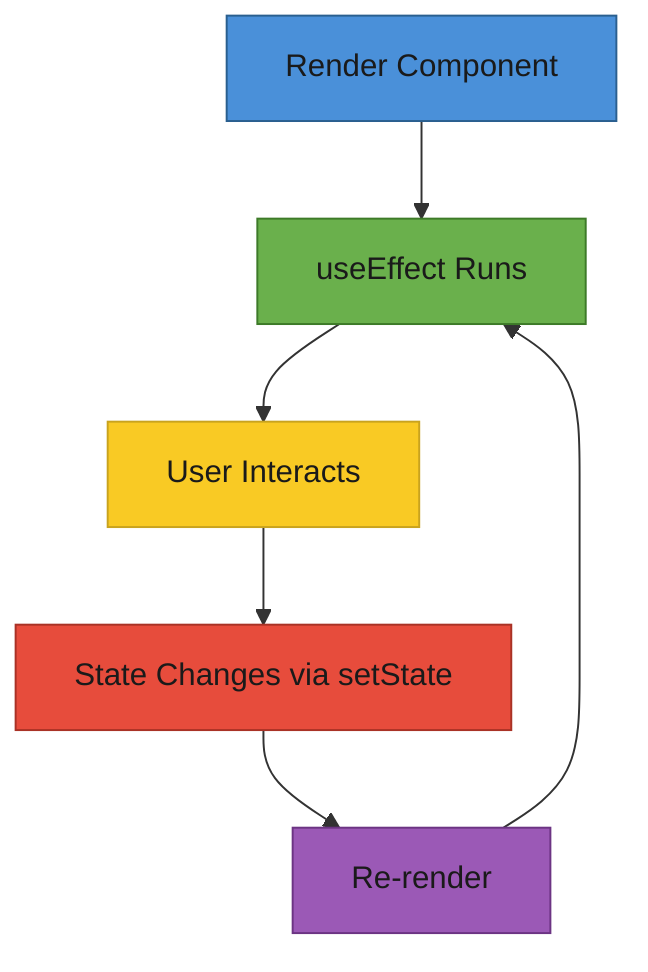

# T29: Estado e Efeitos no React

O estado é o caderno pessoal do componente - dados privados que persistem entre renders e disparam re-renderização quando atualizados. Efeitos são como despertadores que tocam depois do componente renderizar, permitindo sincronizar com sistemas externos como APIs ou timers.
{: .lesson-intro }

## useState: Memória do Componente

O hook `useState` dá ao componente sua própria memória. Retorna o valor atual e uma função setter. Quando o setter é chamado, o React re-renderiza o componente com o novo valor.

```
import { useState } from "react";

function Counter() {
    const [count, setCount] = useState(0);

    return (
        <div>
            <p>Count: {count}</p>
            <button onClick={() => setCount(count + 1)}>+1</button>
            <button onClick={() => setCount(0)}>Reset</button>
        </div>
    );
}
```

## useEffect: Efeitos Colaterais

O hook `useEffect` executa código depois do render. O array de dependências controla quando ele roda de novo. Um array vazio significa "rodar uma vez no mount". Incluir variáveis significa "rodar de novo quando essas mudarem".

```
import { useState, useEffect } from "react";

function MenuPage() {
    const [items, setItems] = useState([]);
    const [loading, setLoading] = useState(true);

    useEffect(() => {
        fetch("/api/menu")
            .then(res => res.json())
            .then(data => {
                setItems(data);
                setLoading(false);
            });
    }, []); // Empty array = run once on mount

    if (loading) return <p>Loading...</p>;
    return <ul>{items.map(i => <li key={i.id}>{i.name}</li>)}</ul>;
}
```

## Lifting State Up

Quando dois componentes irmãos precisam compartilhar dados, mova o estado para o pai comum. O pai é dono do estado e passa para baixo como props. Esse é o principal padrão de compartilhamento de dados do React.



<div class="takeaways">
<h2>Key Takeaways</h2>
<ul>
<li>useState dá memória aos componentes, persistindo entre renders</li>
<li>useEffect roda efeitos colaterais após render, controlado pelo array de dependências</li>
<li>Um array de dependências vazio significa que o efeito roda só uma vez no mount</li>
<li>Eleve o estado para o pai comum mais próximo quando irmãos precisarem compartilhar dados</li>
</ul>
</div>
