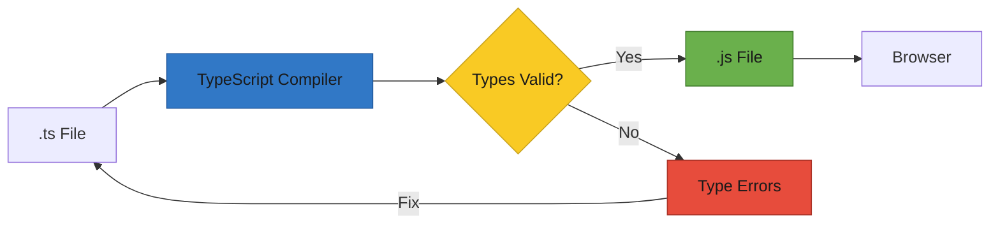

# T30: TypeScript

TypeScriptはJavaScriptの上に型システムを追加します。型は契約のようなもので、料理を作る前にレストランに食事制限を伝えるのに似ています。データがどんな形であるべきかを指定すると、TypeScriptがコード実行前にミスを検出します。
{: .lesson-intro }

## 型アノテーション

TypeScriptでは変数、関数パラメータ、戻り値に型を注釈できます。コンパイラがビルド時にこれらをチェックし、実行前にエラーを報告します。

```
// Basic type annotations
let name: string = "Ramen";
let price: number = 850;
let available: boolean = true;

// Function with typed parameters and return
function formatPrice(amount: number, currency: string): string {
    return `${currency}${amount.toLocaleString()}`;
}

// Arrays
let tags: string[] = ["spicy", "popular"];

// Type error caught at compile time
// price = "free";  // Error: Type 'string' is not assignable to type 'number'
```

## インターフェースとオブジェクト

インターフェースはオブジェクトの形を定義します。コードベース全体で構造の一貫性を強制する設計図として機能します。

```
interface MenuItem {
    id: number;
    name: string;
    price: number;
    category: string;
    available: boolean;
}

function displayItem(item: MenuItem): string {
    return `${item.name} - $${item.price}`;
}

// TypeScript ensures you pass the right shape
const ramen: MenuItem = {
    id: 1,
    name: "Tonkotsu Ramen",
    price: 850,
    category: "noodles",
    available: true,
};
```

## Reactコンポーネントの型付け

TypeScriptとReactは相性が良いです。propsにインターフェースを、stateにジェネリクスを使って型付けし、コンポーネントの契約でエラーを検出します。

```
interface MenuCardProps {
    name: string;
    price: number;
    onOrder: (name: string) => void;
}

function MenuCard({ name, price, onOrder }: MenuCardProps) {
    return (
        <div>
            <h3>{name}</h3>
            <p>${price}</p>
            <button onClick={() => onOrder(name)}>Order</button>
        </div>
    );
}

// Typed useState
const [items, setItems] = useState<MenuItem[]>([]);
```

## ユニオン型とジェネリクス

ユニオン型は値が複数の型のいずれかであることを許可します。ジェネリクスは型安全性を保ちながら、任意の型で動作する再利用可能なコードを書くことができます。



<div class="takeaways">
<h2>まとめ</h2>
<ul>
<li>TypeScriptはコンパイル時に型エラーを検出し、ブラウザでの実行前にミスを防ぐ</li>
<li>インターフェースはオブジェクトの形を定義し、一貫したデータ構造を強制する</li>
<li>Reactのpropsとstateを型付けすることで、安全で自己文書化されたコンポーネントになる</li>
<li>ユニオン型とジェネリクスは型安全性を保ちながら柔軟性を提供する</li>
</ul>
</div>
