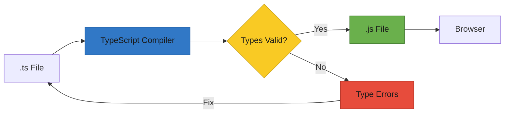

# T30: TypeScript

TypeScript adds a type system on top of JavaScript. Types are like a contract - similar to telling a restaurant your dietary restrictions before they cook. You specify what shape your data should have, and TypeScript catches mistakes before your code ever runs. {.lesson-intro}

## Type Annotations

TypeScript lets you annotate variables, function parameters, and return values with types. The compiler checks these at build time and reports errors before execution.

```
// Basic type annotations
let name: string = "Ramen";
let price: number = 850;
let available: boolean = true;

// Function with typed parameters and return
function formatPrice(amount: number, currency: string): string {
    return `${currency}${amount.toLocaleString()}`;
}

// Arrays
let tags: string[] = ["spicy", "popular"];

// Type error caught at compile time
// price = "free";  // Error: Type 'string' is not assignable to type 'number'
```

## Interfaces and Objects

Interfaces define the shape of an object. They act as blueprints that enforce structure consistency across your codebase.

```
interface MenuItem {
    id: number;
    name: string;
    price: number;
    category: string;
    available: boolean;
}

function displayItem(item: MenuItem): string {
    return `${item.name} - $${item.price}`;
}

// TypeScript ensures you pass the right shape
const ramen: MenuItem = {
    id: 1,
    name: "Tonkotsu Ramen",
    price: 850,
    category: "noodles",
    available: true,
};
```

## Typing React Components

TypeScript and React work well together. You type props with interfaces and state with generics, catching errors in your component contracts.

```
interface MenuCardProps {
    name: string;
    price: number;
    onOrder: (name: string) => void;
}

function MenuCard({ name, price, onOrder }: MenuCardProps) {
    return (
        <div>
            <h3>{name}</h3>
            <p>${price}</p>
            <button onClick={() => onOrder(name)}>Order</button>
        </div>
    );
}

// Typed useState
const [items, setItems] = useState<MenuItem[]>([]);
```

## Union Types and Generics

Union types let a value be one of several types. Generics let you write reusable code that works with any type while preserving type safety.



<div class="takeaways">
<h2>Key Takeaways</h2>
<ul>
<li>TypeScript catches type errors at compile time, before code runs in the browser</li>
<li>Interfaces define object shapes, enforcing consistent data structures</li>
<li>React props and state can be typed for safer, self-documenting components</li>
<li>Union types and generics provide flexibility while keeping type safety</li>
</ul>
</div>
