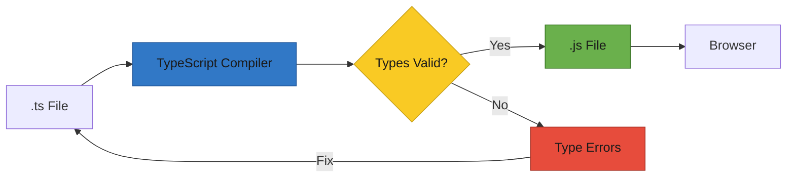

# T30: TypeScript

TypeScript adiciona um sistema de tipos sobre o JavaScript. Tipos são como um contrato - parecido com avisar num restaurante das suas restrições alimentares antes do cozinheiro começar. Você especifica o formato que seus dados devem ter, e o TypeScript pega erros antes do código rodar.
{: .lesson-intro }

## Anotações de Tipo

TypeScript permite anotar variáveis, parâmetros de função e valores de retorno com tipos. O compilador confere em build time e reporta erros antes da execução.

```
// Basic type annotations
let name: string = "Ramen";
let price: number = 850;
let available: boolean = true;

// Function with typed parameters and return
function formatPrice(amount: number, currency: string): string {
    return `${currency}${amount.toLocaleString()}`;
}

// Arrays
let tags: string[] = ["spicy", "popular"];

// Type error caught at compile time
// price = "free";  // Error: Type 'string' is not assignable to type 'number'
```

## Interfaces e Objetos

Interfaces definem o formato de um objeto. Elas agem como plantas que garantem consistência de estrutura pelo seu código.

```
interface MenuItem {
    id: number;
    name: string;
    price: number;
    category: string;
    available: boolean;
}

function displayItem(item: MenuItem): string {
    return `${item.name} - $${item.price}`;
}

// TypeScript ensures you pass the right shape
const ramen: MenuItem = {
    id: 1,
    name: "Tonkotsu Ramen",
    price: 850,
    category: "noodles",
    available: true,
};
```

## Tipando Componentes React

TypeScript e React se dão bem. Você tipa props com interfaces e estado com genéricos, pegando erros nos contratos dos seus componentes.

```
interface MenuCardProps {
    name: string;
    price: number;
    onOrder: (name: string) => void;
}

function MenuCard({ name, price, onOrder }: MenuCardProps) {
    return (
        <div>
            <h3>{name}</h3>
            <p>${price}</p>
            <button onClick={() => onOrder(name)}>Order</button>
        </div>
    );
}

// Typed useState
const [items, setItems] = useState<MenuItem[]>([]);
```

## Union Types e Genéricos

Union types permitem que um valor seja um de vários tipos. Genéricos deixam você escrever código reutilizável que funciona com qualquer tipo preservando a segurança.



<div class="takeaways">
<h2>Key Takeaways</h2>
<ul>
<li>TypeScript pega erros de tipo em compile time, antes do código rodar no navegador</li>
<li>Interfaces definem formato de objetos, garantindo estruturas de dados consistentes</li>
<li>Props e estado do React podem ser tipados para componentes mais seguros e auto-documentados</li>
<li>Union types e genéricos oferecem flexibilidade mantendo a segurança de tipo</li>
</ul>
</div>
