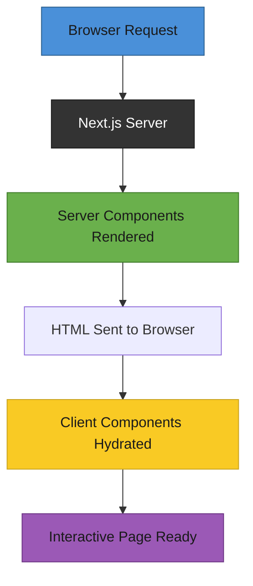

# T31: Next.jsのルーティングとレンダリング

Next.jsはフードトラック(React SPA)から住所システム付きの本格的なレストランへのアップグレードのようなものです。ファイルベースのルーティング、サーバーサイドレンダリング、明確な構造を追加するので、全てを自分で接続する必要がありません。
{: .lesson-intro }

## ファイルベースルーティング

Next.jsではファイルシステムがルーターです。`app/about/page.tsx`にファイルを作成すると、それが`/about`ルートになります。ルーター設定は不要です。T13のハッシュベースルーティングと比較してみてください。

```
// Directory structure = URL structure
app/
  page.tsx          // "/" route
  about/
    page.tsx        // "/about" route
  menu/
    page.tsx        // "/menu" route
    [id]/
      page.tsx      // "/menu/123" dynamic route

// app/menu/page.tsx
export default function MenuPage() {
    return (
        <main>
            <h1>Our Menu</h1>
            <p>Browse our selection below.</p>
        </main>
    );
}
```

## サーバーコンポーネント vs クライアントコンポーネント

Next.jsのコンポーネントはデフォルトでサーバーコンポーネントです。サーバーで実行され、データを直接取得でき、HTMLのみをブラウザに送信します。ステートやイベントハンドラなどのインタラクティブ性が必要な場合は、先頭に`"use client"`を追加します。

```
// Server component (default) - runs on server, no JS sent to browser
export default async function MenuList() {
    const items = await fetch("https://api.example.com/menu").then(r => r.json());
    return <ul>{items.map(i => <li key={i.id}>{i.name}</li>)}</ul>;
}

// Client component - needs "use client" for interactivity
"use client";
import { useState } from "react";

export default function AddToCart({ itemId }: { itemId: number }) {
    const [added, setAdded] = useState(false);
    return (
        <button onClick={() => setAdded(true)}>
            {added ? "Added" : "Add to Cart"}
        </button>
    );
}
```

## レイアウト

`layout.tsx`はそのディレクトリ以下の全ページをラップします。ナビゲーション間で保持され、ヘッダーやサイドバーなどの共有UIをマウントしたままにします。

## 使い分けガイド

静的コンテンツやデータ取得にはサーバーコンポーネントを使用します。useState、useEffect、onClick、ブラウザ専用APIが必要な場合のみクライアントコンポーネントを使用します。



<div class="takeaways">
<h2>まとめ</h2>
<ul>
<li>ファイルベースルーティングはディレクトリ構造をURLにマッピングする。設定不要</li>
<li>コンポーネントはデフォルトでサーバーレンダリングされ、HTMLのみをブラウザに送信する</li>
<li>"use client"はコンポーネントがステート、エフェクト、イベントハンドラを必要とする場合のみ追加する</li>
<li>レイアウトは子ページをラップし、共有UIのためにナビゲーション間で保持される</li>
</ul>
</div>
