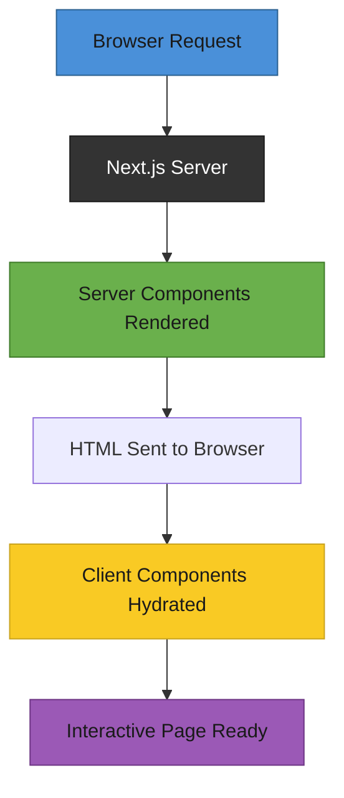

# T31: Next.js Routing & Rendering

Next.js is like upgrading from a food truck (React SPA) to a proper restaurant with a built-in address system. It adds file-based routing, server-side rendering, and a clear structure so you do not have to wire everything together yourself.
{: .lesson-intro }

## File-Based Routing

In Next.js, the file system is the router. Create a file at `app/about/page.tsx` and it becomes the `/about` route. No router configuration needed - compare this to the hash-based routing from T16.

```
// Directory structure = URL structure
app/
  page.tsx          // "/" route
  about/
    page.tsx        // "/about" route
  menu/
    page.tsx        // "/menu" route
    [id]/
      page.tsx      // "/menu/123" dynamic route

// app/menu/page.tsx
export default function MenuPage() {
    return (
        <main>
            <h1>Our Menu</h1>
            <p>Browse our selection below.</p>
        </main>
    );
}
```

## Server vs Client Components

Next.js components are server components by default. They run on the server, can fetch data directly, and send only HTML to the browser. Add `"use client"` at the top when you need interactivity like state or event handlers.

```
// Server component (default) - runs on server, no JS sent to browser
export default async function MenuList() {
    const items = await fetch("https://api.example.com/menu").then(r => r.json());
    return <ul>{items.map(i => <li key={i.id}>{i.name}</li>)}</ul>;
}

// Client component - needs "use client" for interactivity
"use client";
import { useState } from "react";

export default function AddToCart({ itemId }: { itemId: number }) {
    const [added, setAdded] = useState(false);
    return (
        <button onClick={() => setAdded(true)}>
            {added ? "Added" : "Add to Cart"}
        </button>
    );
}
```

## Layouts

A `layout.tsx` wraps all pages in its directory and below. It persists across navigation, keeping shared UI like headers and sidebars mounted.

## When to Use What

Use server components for static content and data fetching. Use client components only when you need useState, useEffect, onClick, or browser-only APIs.



<div class="takeaways">
<h2>Key Takeaways</h2>
<ul>
<li>File-based routing maps directory structure to URLs - no configuration needed</li>
<li>Components are server-rendered by default, sending only HTML to the browser</li>
<li>Add "use client" only when a component needs state, effects, or event handlers</li>
<li>Layouts wrap child pages and persist across navigation for shared UI</li>
</ul>
</div>
