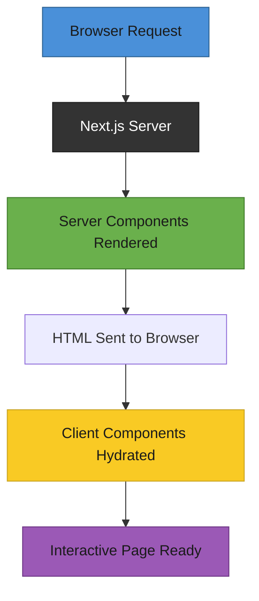

# T31: Roteamento e Renderização no Next.js

Next.js é como passar de um food truck (SPA React) para um restaurante de verdade com sistema de endereço embutido. Ele adiciona roteamento baseado em arquivos, renderização no servidor e uma estrutura clara para você não precisar conectar tudo na mão.
{: .lesson-intro }

## Roteamento Baseado em Arquivos

No Next.js, o sistema de arquivos é o roteador. Crie um arquivo em `app/about/page.tsx` e ele vira a rota `/about`. Sem configuração de router - compare com o roteamento por hash do T16.

```
// Directory structure = URL structure
app/
  page.tsx          // "/" route
  about/
    page.tsx        // "/about" route
  menu/
    page.tsx        // "/menu" route
    [id]/
      page.tsx      // "/menu/123" dynamic route

// app/menu/page.tsx
export default function MenuPage() {
    return (
        <main>
            <h1>Our Menu</h1>
            <p>Browse our selection below.</p>
        </main>
    );
}
```

## Server vs Client Components

Componentes no Next.js são server components por padrão. Rodam no servidor, podem buscar dados diretamente e enviam só HTML para o navegador. Adicione `"use client"` no topo quando precisar de interatividade como estado ou handlers de evento.

```
// Server component (default) - runs on server, no JS sent to browser
export default async function MenuList() {
    const items = await fetch("https://api.example.com/menu").then(r => r.json());
    return <ul>{items.map(i => <li key={i.id}>{i.name}</li>)}</ul>;
}

// Client component - needs "use client" for interactivity
"use client";
import { useState } from "react";

export default function AddToCart({ itemId }: { itemId: number }) {
    const [added, setAdded] = useState(false);
    return (
        <button onClick={() => setAdded(true)}>
            {added ? "Added" : "Add to Cart"}
        </button>
    );
}
```

## Layouts

Um `layout.tsx` envelopa todas as páginas no seu diretório e abaixo. Ele persiste entre navegações, mantendo UI compartilhada como headers e sidebars montada.

## Quando Usar Cada Um

Use server components para conteúdo estático e busca de dados. Use client components só quando precisa de useState, useEffect, onClick ou APIs só de navegador.



<div class="takeaways">
<h2>Pontos-chave</h2>
<ul>
<li>Roteamento baseado em arquivos mapeia estrutura de diretórios em URLs - sem configuração</li>
<li>Componentes são renderizados no servidor por padrão, enviando só HTML para o navegador</li>
<li>Adicione "use client" só quando um componente precisa de estado, efeitos ou handlers de evento</li>
<li>Layouts envelopam páginas filhas e persistem entre navegações para UI compartilhada</li>
</ul>
</div>
