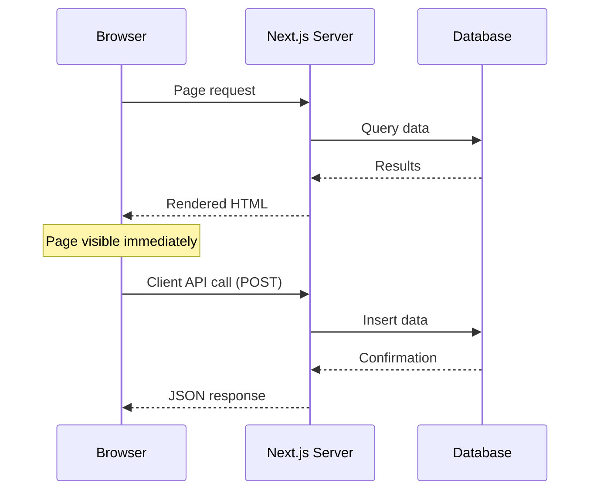

# T32: Next.jsのデータとAPI

サーバーコンポーネントのデータ取得は、ウェイターを往復させる代わりにシェフが直接パントリーに行くようなものです。useEffectもローディングスピナーも不要です。コンポーネント自体がasyncで、必要なデータを取得し、サーバーで完全なHTMLをレンダリングします。 {.lesson-intro}

## サーバーコンポーネントでのデータ取得

サーバーコンポーネントはasync関数にできます。コンポーネント本体で直接データをawaitします。useEffectもローディングステート用のuseStateも不要で、HTMLは完全にレンダリングされた状態で届きます。

```
// app/menu/page.tsx - Server component (default)
interface MenuItem {
    id: number;
    name: string;
    price: number;
}

export default async function MenuPage() {
    const res = await fetch("https://api.example.com/menu", {
        cache: "no-store",  // Always get fresh data
    });
    const items: MenuItem[] = await res.json();

    return (
        <main>
            <h1>Menu</h1>
            <ul>
                {items.map(item => (
                    <li key={item.id}>
                        {item.name} - ${item.price}
                    </li>
                ))}
            </ul>
        </main>
    );
}
```

## APIルート

Next.jsのAPIルートは`route.ts`ファイルに記述します。GET、POST、その他のHTTPメソッドを名前付きエクスポートとして処理します。T17のExpressルートと比較してみてください。同じ概念で、構文が異なります。

```
// app/api/menu/route.ts
import { NextResponse } from "next/server";

const menu = [
    { id: 1, name: "Tonkotsu Ramen", price: 850 },
    { id: 2, name: "Gyoza", price: 400 },
];

export async function GET() {
    return NextResponse.json(menu);
}

export async function POST(request: Request) {
    const body = await request.json();
    const newItem = { id: menu.length + 1, ...body };
    menu.push(newItem);
    return NextResponse.json(newItem, { status: 201 });
}
```

## 全体の組み立て

典型的なNext.jsページはサーバーでデータを取得し、HTMLをレンダリングしてブラウザに送信します。クライアントコンポーネントはアイテムの追加やフォーム送信などのインタラクティブ機能を処理し、必要に応じてAPIルートを呼び出します。



<div class="takeaways">
<h2>まとめ</h2>
<ul>
<li>サーバーコンポーネントはasyncにでき、useEffectやローディングステートなしでデータを直接取得する</li>
<li>APIルートはroute.tsファイルで名前付きエクスポート(GET, POST)を使い、クリーンなエンドポイント定義ができる</li>
<li>サーバーレンダリングされたページは完全に構築された状態で届き、初期読み込みのパフォーマンスが向上する</li>
<li>クライアントサイドのAPI呼び出しはハイドレーション後にミューテーションとインタラクティブ機能を処理する</li>
</ul>
</div>
