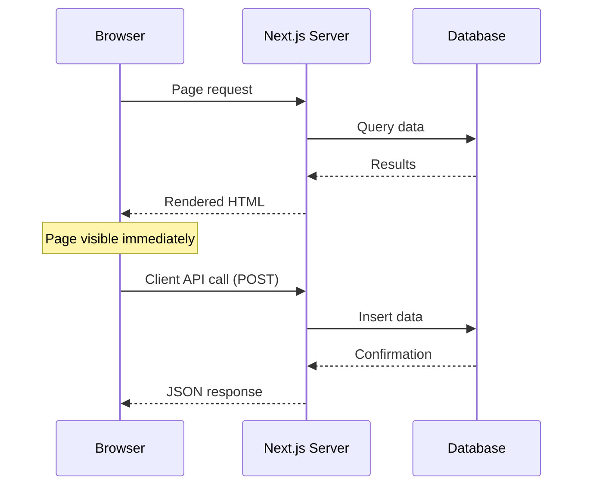

# T32: Next.js Data & API

Server components fetch data like a chef going directly to the pantry instead of sending a waiter back and forth. No useEffect, no loading spinners for initial data - the component itself is async, fetches what it needs, and renders the complete HTML on the server.
{: .lesson-intro }

## Fetching Data in Server Components

Server components can be async functions. You await data directly in the component body. No useEffect, no useState for loading states - the HTML arrives fully rendered.

```
// app/menu/page.tsx - Server component (default)
interface MenuItem {
    id: number;
    name: string;
    price: number;
}

export default async function MenuPage() {
    const res = await fetch("https://api.example.com/menu", {
        cache: "no-store",  // Always get fresh data
    });
    const items: MenuItem[] = await res.json();

    return (
        <main>
            <h1>Menu</h1>
            <ul>
                {items.map(item => (
                    <li key={item.id}>
                        {item.name} - ${item.price}
                    </li>
                ))}
            </ul>
        </main>
    );
}
```

## API Routes

Next.js API routes live in `route.ts` files. They handle GET, POST, and other HTTP methods as named exports. Compare this to the Express routes from T22 - same concept, different syntax.

```
// app/api/menu/route.ts
import { NextResponse } from "next/server";

const menu = [
    { id: 1, name: "Tonkotsu Ramen", price: 850 },
    { id: 2, name: "Gyoza", price: 400 },
];

export async function GET() {
    return NextResponse.json(menu);
}

export async function POST(request: Request) {
    const body = await request.json();
    const newItem = { id: menu.length + 1, ...body };
    menu.push(newItem);
    return NextResponse.json(newItem, { status: 201 });
}
```

## Putting It All Together

A typical Next.js page fetches data on the server, renders HTML, and sends it to the browser. Client components handle interactivity like adding items or submitting forms, calling API routes as needed.



<div class="takeaways">
<h2>Key Takeaways</h2>
<ul>
<li>Server components can be async - fetch data directly without useEffect or loading state</li>
<li>API routes use named exports (GET, POST) in route.ts files for clean endpoint definitions</li>
<li>Server-rendered pages arrive fully built, improving initial load performance</li>
<li>Client-side API calls handle mutations and interactive features after hydration</li>
</ul>
</div>
