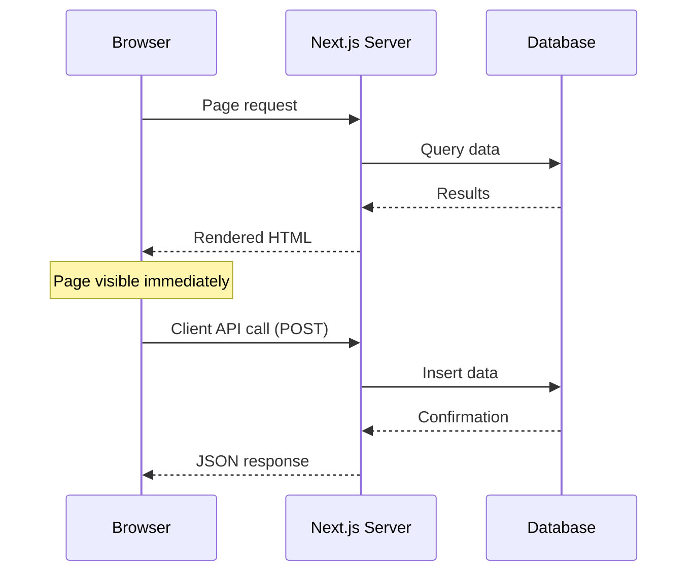

# T32: Dados e API no Next.js

Server components buscam dados como um chef indo direto na despensa em vez de mandar um garçom ir e voltar. Sem useEffect, sem spinners de loading para dados iniciais - o próprio componente é assíncrono, busca o que precisa e renderiza o HTML completo no servidor.
{: .lesson-intro }

## Buscando Dados em Server Components

Server components podem ser funções async. Você faz await nos dados direto no corpo do componente. Sem useEffect, sem useState para estado de loading - o HTML chega totalmente renderizado.

```
// app/menu/page.tsx - Server component (default)
interface MenuItem {
    id: number;
    name: string;
    price: number;
}

export default async function MenuPage() {
    const res = await fetch("https://api.example.com/menu", {
        cache: "no-store",  // Always get fresh data
    });
    const items: MenuItem[] = await res.json();

    return (
        <main>
            <h1>Menu</h1>
            <ul>
                {items.map(item => (
                    <li key={item.id}>
                        {item.name} - ${item.price}
                    </li>
                ))}
            </ul>
        </main>
    );
}
```

## Rotas de API

Rotas de API do Next.js moram em arquivos `route.ts`. Elas tratam GET, POST e outros métodos HTTP como exports nomeados. Compare com as rotas do Express do T22 - mesmo conceito, sintaxe diferente.

```
// app/api/menu/route.ts
import { NextResponse } from "next/server";

const menu = [
    { id: 1, name: "Tonkotsu Ramen", price: 850 },
    { id: 2, name: "Gyoza", price: 400 },
];

export async function GET() {
    return NextResponse.json(menu);
}

export async function POST(request: Request) {
    const body = await request.json();
    const newItem = { id: menu.length + 1, ...body };
    menu.push(newItem);
    return NextResponse.json(newItem, { status: 201 });
}
```

## Juntando Tudo

Uma página típica do Next.js busca dados no servidor, renderiza HTML e envia para o navegador. Client components cuidam da interatividade como adicionar itens ou enviar formulários, chamando rotas de API conforme necessário.



<div class="takeaways">
<h2>Key Takeaways</h2>
<ul>
<li>Server components podem ser async - busque dados diretamente sem useEffect ou estado de loading</li>
<li>Rotas de API usam exports nomeados (GET, POST) em arquivos route.ts para definições de endpoint limpas</li>
<li>Páginas renderizadas no servidor chegam completas, melhorando performance do primeiro carregamento</li>
<li>Chamadas de API no cliente cuidam de mutações e features interativas depois da hidratação</li>
</ul>
</div>
