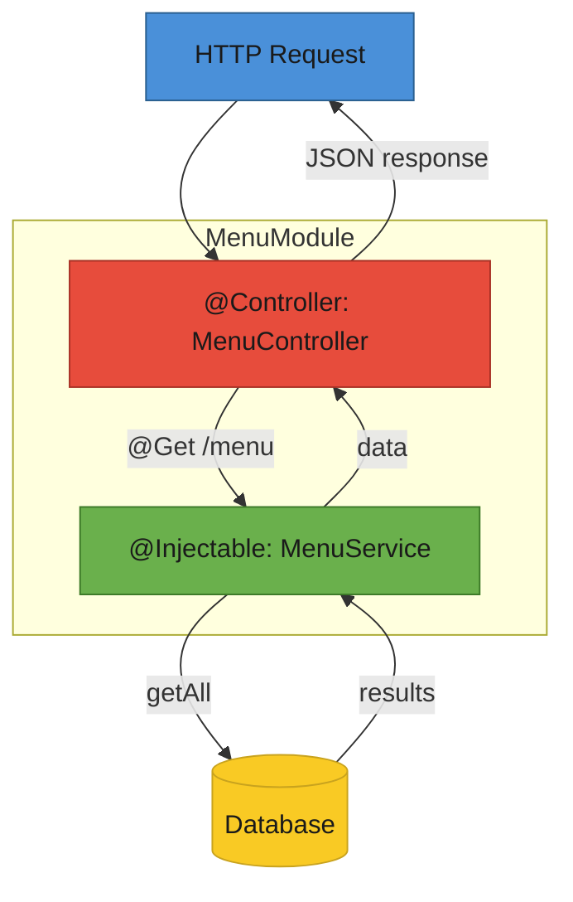

# T33: Nest.jsアーキテクチャ

Nest.jsはNode.jsアプリをモジュールに整理します。各モジュールはコントローラ(HTTPを捌く)、サービス(実際の仕事をする)、それらを配線する依存性注入をグループ化する。T21の素のNode.jsは小さなアプリには動くが、規模が大きくなると構造が必要。Nest.jsは強制されたパターンとテスト支援を提供する。
{: .lesson-intro }

## モジュール、コントローラ、サービス

すべてのNest.jsアプリはモジュールに整理されます。各モジュールは関連するコントローラ(HTTPを処理)とサービス(ビジネスロジックを処理)をグループ化する。`@Controller` や `@Injectable` のようなデコレータが各クラスの役割をフレームワークに伝える。

```
// menu.module.ts
import { Module } from "@nestjs/common";
import { MenuController } from "./menu.controller";
import { MenuService } from "./menu.service";

@Module({
    controllers: [MenuController],
    providers: [MenuService],
})
export class MenuModule {}

// menu.controller.ts
import { Controller, Get, Post, Body } from "@nestjs/common";
import { MenuService } from "./menu.service";

@Controller("menu")
export class MenuController {
    constructor(private readonly menuService: MenuService) {}

    @Get()
    findAll() {
        return this.menuService.findAll();
    }

    @Post()
    create(@Body() body: { name: string; price: number }) {
        return this.menuService.create(body);
    }
}

// menu.service.ts
import { Injectable } from "@nestjs/common";

@Injectable()
export class MenuService {
    private items = [
        { id: 1, name: "Tonkotsu Ramen", price: 850 },
    ];

    findAll() {
        return this.items;
    }

    create(data: { name: string; price: number }) {
        const item = { id: this.items.length + 1, ...data };
        this.items.push(item);
        return item;
    }
}
```

## 依存性注入

コントローラは自分のサービスを作らない。コンストラクタで必要なものを宣言し、フレームワークがそれを提供する。これがテストを簡単にする - コントローラコードを変えずにモックサービスに差し替えられる。

```
// コントローラは依存を宣言する
constructor(private readonly menuService: MenuService) {}

// Nest.jsが自動でMenuServiceインスタンスを作って注入する
// テストではモックを提供できる:
// { provide: MenuService, useValue: mockMenuService }
```

## デコレータとTypeScript

Nest.jsはTypeScriptのデコレータを広く使う。`@Controller`、`@Get`、`@Post`、`@Body`、`@Injectable` - これらの注釈がロジックを乱すことなく挙動を定義する。



<div class="takeaways">
<h2>まとめ</h2>
<ul>
<li>Nest.jsはモジュール、コントローラ、サービスの3本柱で構造を強制する</li>
<li>コントローラはHTTPルーティング、サービスはビジネスロジックを担当 - 混ぜない</li>
<li>依存性注入がコンポーネント間を配線し、テストを単純化する</li>
<li>TypeScriptのデコレータが挙動を宣言的に定義し、ロジックを乱さない</li>
</ul>
</div>
