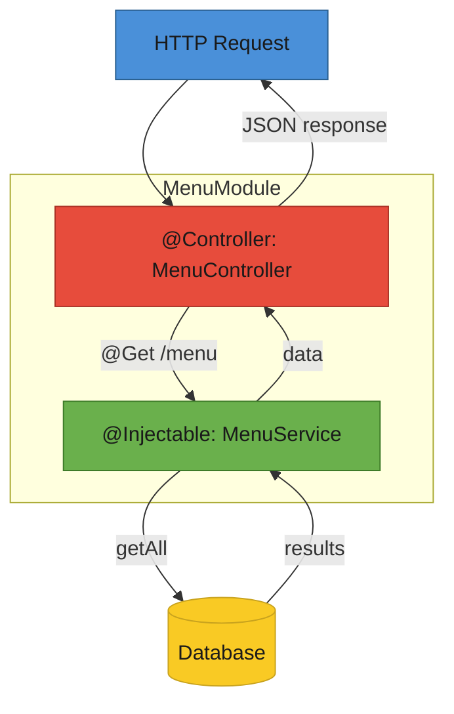

# T33: Nest.jsのアーキテクチャ

Nest.jsはレストランチェーンの運営マニュアルのようなものです。モジュールは部署、コントローラーは注文を受けるウェイター、サービスは実際に調理するシェフ、そして依存性注入はウェイターが詳細を知る必要なくシェフを配置するマネージャーです。
{: .lesson-intro }

## フレームワークが必要な理由

T16の素のNode.jsは小さなアプリには十分ですが、スケールするには構造が必要です。Nest.jsは明確な関心の分離、強制されたパターン、テストとモジュール性の組み込みサポートを提供します。

## モジュール、コントローラー、サービス

全てのNest.jsアプリはモジュールに整理されます。各モジュールは関連するコントローラー(HTTPを処理)とサービス(ビジネスロジックを処理)をグループ化します。`@Controller`や`@Injectable`のようなデコレータが各クラスの役割をフレームワークに伝えます。

```
// menu.module.ts
import { Module } from "@nestjs/common";
import { MenuController } from "./menu.controller";
import { MenuService } from "./menu.service";

@Module({
    controllers: [MenuController],
    providers: [MenuService],
})
export class MenuModule {}

// menu.controller.ts
import { Controller, Get, Post, Body } from "@nestjs/common";
import { MenuService } from "./menu.service";

@Controller("menu")
export class MenuController {
    constructor(private readonly menuService: MenuService) {}

    @Get()
    findAll() {
        return this.menuService.findAll();
    }

    @Post()
    create(@Body() body: { name: string; price: number }) {
        return this.menuService.create(body);
    }
}

// menu.service.ts
import { Injectable } from "@nestjs/common";

@Injectable()
export class MenuService {
    private items = [
        { id: 1, name: "Tonkotsu Ramen", price: 850 },
    ];

    findAll() {
        return this.items;
    }

    create(data: { name: string; price: number }) {
        const item = { id: this.items.length + 1, ...data };
        this.items.push(item);
        return item;
    }
}
```

## 依存性注入

コントローラーは自分でサービスを作成しません。コンストラクタで必要なものを宣言し、フレームワークがそれを提供します。これによりテストが容易になります。コントローラーのコードを変更せずにモックサービスに差し替えられます。

```
// The controller declares its dependency
constructor(private readonly menuService: MenuService) {}

// Nest.js automatically creates and injects the MenuService instance
// In tests, you can provide a mock instead:
// { provide: MenuService, useValue: mockMenuService }
```

## デコレータとTypeScript

Nest.jsはTypeScriptのデコレータを多用します。`@Controller`、`@Get`、`@Post`、`@Body`、`@Injectable`。これらのアノテーションがロジックを散らかすことなく振る舞いを定義します。



<div class="takeaways">
<h2>まとめ</h2>
<ul>
<li>Nest.jsはモジュール、コントローラー、サービスの3本柱で構造を強制する</li>
<li>コントローラーはHTTPルーティング、サービスはビジネスロジックを処理する。混在させないこと</li>
<li>依存性注入によりフレームワークがコンポーネントを接続し、テストが簡単になる</li>
<li>TypeScriptデコレータがロジックを散らかすことなく宣言的に振る舞いを定義する</li>
</ul>
</div>
