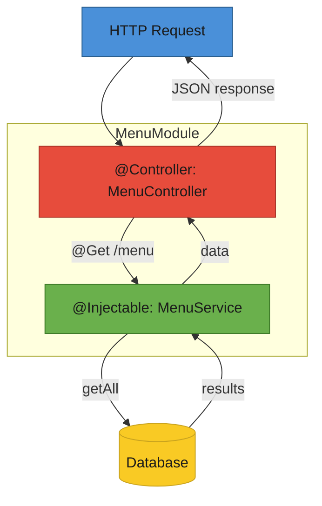

# T33: Nest.js Architecture

Nest.js is like an operations manual for a restaurant chain. Modules are departments, Controllers are the waiters taking orders, Services are the chefs doing the real work, and Dependency Injection is the manager who assigns chefs to stations without waiters needing to know the details. {.lesson-intro}

## Why a Framework?

Raw Node.js from T21 works for small apps, but at scale you need structure. Nest.js provides clear separation of concerns, enforced patterns, and built-in support for testing and modularity.

## Modules, Controllers, Services

Every Nest.js app is organized into modules. Each module groups related controllers (handle HTTP) and services (handle business logic). Decorators like `@Controller` and `@Injectable` tell the framework what each class does.

```
// menu.module.ts
import { Module } from "@nestjs/common";
import { MenuController } from "./menu.controller";
import { MenuService } from "./menu.service";

@Module({
    controllers: [MenuController],
    providers: [MenuService],
})
export class MenuModule {}

// menu.controller.ts
import { Controller, Get, Post, Body } from "@nestjs/common";
import { MenuService } from "./menu.service";

@Controller("menu")
export class MenuController {
    constructor(private readonly menuService: MenuService) {}

    @Get()
    findAll() {
        return this.menuService.findAll();
    }

    @Post()
    create(@Body() body: { name: string; price: number }) {
        return this.menuService.create(body);
    }
}

// menu.service.ts
import { Injectable } from "@nestjs/common";

@Injectable()
export class MenuService {
    private items = [
        { id: 1, name: "Tonkotsu Ramen", price: 850 },
    ];

    findAll() {
        return this.items;
    }

    create(data: { name: string; price: number }) {
        const item = { id: this.items.length + 1, ...data };
        this.items.push(item);
        return item;
    }
}
```

## Dependency Injection

The controller does not create its own service. It declares what it needs in the constructor, and the framework provides it. This makes testing easy - you can swap in mock services without changing controller code.

```
// The controller declares its dependency
constructor(private readonly menuService: MenuService) {}

// Nest.js automatically creates and injects the MenuService instance
// In tests, you can provide a mock instead:
// { provide: MenuService, useValue: mockMenuService }
```

## Decorators and TypeScript

Nest.js uses TypeScript decorators extensively. `@Controller`, `@Get`, `@Post`, `@Body`, `@Injectable` - these annotations define behavior without cluttering your logic.



<div class="takeaways">
<h2>Key Takeaways</h2>
<ul>
<li>Nest.js enforces structure with modules, controllers, and services as the three pillars</li>
<li>Controllers handle HTTP routing, services handle business logic - never mix them</li>
<li>Dependency injection lets the framework wire components together, simplifying testing</li>
<li>TypeScript decorators define behavior declaratively without cluttering your logic</li>
</ul>
</div>
