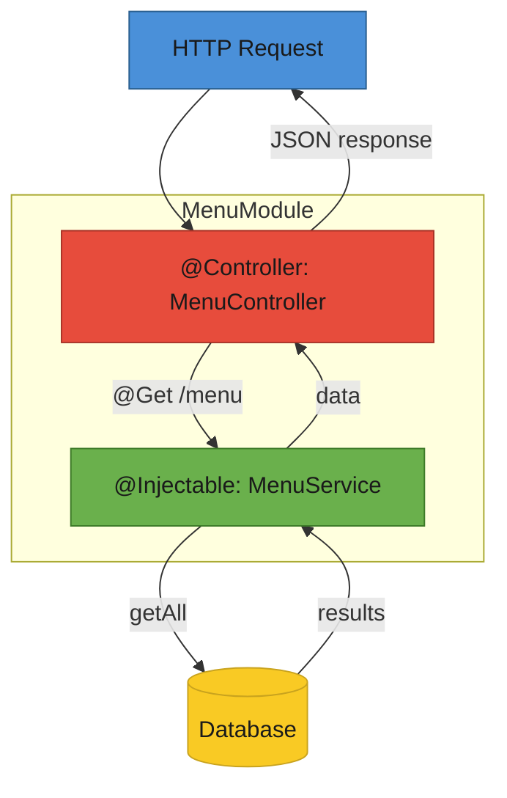

# T33: Arquitetura do Nest.js

Nest.js é como um manual de operações para uma rede de restaurantes. Modules são departamentos, Controllers são os garçons anotando pedidos, Services são os chefs fazendo o trabalho de verdade, e Injeção de Dependência é o gerente que aloca chefs nas estações sem os garçons precisarem saber os detalhes.
{: .lesson-intro }

## Por Que um Framework?

Node.js puro do T21 funciona para apps pequenos, mas em escala você precisa de estrutura. Nest.js oferece separação clara de responsabilidades, padrões impostos e suporte embutido a testes e modularidade.

## Modules, Controllers, Services

Todo app Nest.js é organizado em módulos. Cada módulo agrupa controllers relacionados (cuidam de HTTP) e services (cuidam da lógica de negócio). Decoradores como `@Controller` e `@Injectable` dizem ao framework o que cada classe faz.

```
// menu.module.ts
import { Module } from "@nestjs/common";
import { MenuController } from "./menu.controller";
import { MenuService } from "./menu.service";

@Module({
    controllers: [MenuController],
    providers: [MenuService],
})
export class MenuModule {}

// menu.controller.ts
import { Controller, Get, Post, Body } from "@nestjs/common";
import { MenuService } from "./menu.service";

@Controller("menu")
export class MenuController {
    constructor(private readonly menuService: MenuService) {}

    @Get()
    findAll() {
        return this.menuService.findAll();
    }

    @Post()
    create(@Body() body: { name: string; price: number }) {
        return this.menuService.create(body);
    }
}

// menu.service.ts
import { Injectable } from "@nestjs/common";

@Injectable()
export class MenuService {
    private items = [
        { id: 1, name: "Tonkotsu Ramen", price: 850 },
    ];

    findAll() {
        return this.items;
    }

    create(data: { name: string; price: number }) {
        const item = { id: this.items.length + 1, ...data };
        this.items.push(item);
        return item;
    }
}
```

## Injeção de Dependência

O controller não cria seu próprio service. Ele declara o que precisa no construtor, e o framework provê. Isso facilita testes - você pode trocar por services mocks sem mudar o código do controller.

```
// The controller declares its dependency
constructor(private readonly menuService: MenuService) {}

// Nest.js automatically creates and injects the MenuService instance
// In tests, you can provide a mock instead:
// { provide: MenuService, useValue: mockMenuService }
```

## Decoradores e TypeScript

Nest.js usa decoradores do TypeScript extensivamente. `@Controller`, `@Get`, `@Post`, `@Body`, `@Injectable` - essas anotações definem comportamento sem sujar sua lógica.



<div class="takeaways">
<h2>Pontos-chave</h2>
<ul>
<li>Nest.js impõe estrutura com modules, controllers e services como os três pilares</li>
<li>Controllers cuidam de roteamento HTTP, services cuidam de lógica de negócio - nunca misture</li>
<li>Injeção de dependência deixa o framework conectar componentes, simplificando testes</li>
<li>Decoradores do TypeScript definem comportamento declarativamente sem sujar sua lógica</li>
</ul>
</div>
