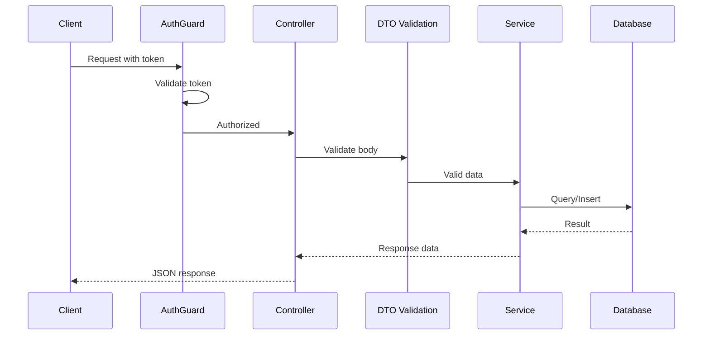

# T34: Nest.jsのデータと認証

DTOはウェイターがキッチンに理解できる内容を正確に書く注文票のようなものです。ガードはドアでIDをチェックする用心棒です。データベース統合と合わせて、Nest.jsアプリケーションのデータとセキュリティ層を形成します。
{: .lesson-intro }

## DTOとバリデーション

Data Transfer Objectは受信データの期待される形を定義します。class-validatorデコレータと組み合わせることで、無効なリクエストを自動的に拒否します。T17の手動バリデーションと比較してください。Nest.jsは宣言的に処理します。

```
// create-menu-item.dto.ts
import { IsString, IsNumber, Min, MaxLength } from "class-validator";

export class CreateMenuItemDto {
    @IsString()
    @MaxLength(100)
    name: string;

    @IsNumber()
    @Min(0)
    price: number;

    @IsString()
    category: string;
}

// menu.controller.ts
import { Controller, Post, Body } from "@nestjs/common";

@Controller("menu")
export class MenuController {
    constructor(private readonly menuService: MenuService) {}

    @Post()
    create(@Body() dto: CreateMenuItemDto) {
        // dto is already validated - invalid requests never reach here
        return this.menuService.create(dto);
    }
}
```

## データベース統合

Nest.jsはT19のSQLiteデータベースパターンと連携しますが、リポジトリ層を通して行います。サービスがデータベースとやり取りし、データアクセスをHTTP処理から分離します。

## 認証ガード

ガードはリクエストを続行すべきかを判断するクラスです。コントローラーがリクエストを見る前に認証トークンをチェックします。`@UseGuards`デコレータで特定のルートまたはコントローラー全体に適用します。

```
// auth.guard.ts
import { CanActivate, ExecutionContext, Injectable, UnauthorizedException } from "@nestjs/common";

@Injectable()
export class AuthGuard implements CanActivate {
    canActivate(context: ExecutionContext): boolean {
        const request = context.switchToHttp().getRequest();
        const token = request.headers["authorization"];
        if (!token || !this.validateToken(token)) {
            throw new UnauthorizedException("Invalid or missing token");
        }
        return true;
    }

    private validateToken(token: string): boolean {
        // Token validation logic
        return token.startsWith("Bearer ");
    }
}

// Using the guard on a controller
import { Controller, Get, UseGuards } from "@nestjs/common";

@Controller("admin/menu")
@UseGuards(AuthGuard)
export class AdminMenuController {
    constructor(private readonly menuService: MenuService) {}

    @Get()
    findAll() {
        return this.menuService.findAll();
    }
}
```



<div class="takeaways">
<h2>まとめ</h2>
<ul>
<li>DTOとclass-validatorデコレータが宣言的にバリデーションを処理し、手動チェックが不要になる</li>
<li>リポジトリパターンでデータベースアクセスをサービスに保ち、コントローラーから分離する</li>
<li>ガードはコントローラーの前に実行され、フレームワークレベルで認証を強制する</li>
<li>@UseGuardsや@Bodyのようなデコレータがロジックを散らかすことなくセキュリティとバリデーションを接続する</li>
</ul>
</div>
