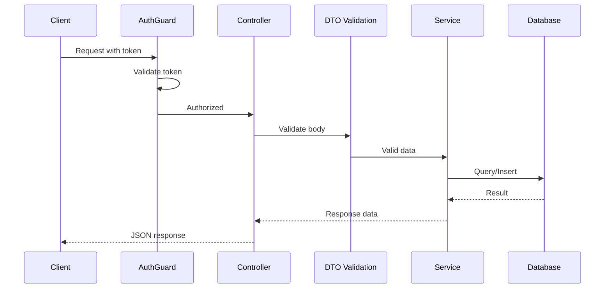

# T34: Nest.js Data & Auth

DTOs are like order tickets that ensure the waiter writes exactly what the kitchen understands. Guards are the bouncer checking IDs at the door. Together with database integration, they form the data and security layer of a Nest.js application. {.lesson-intro}

## DTOs and Validation

A Data Transfer Object defines the expected shape of incoming data. Combined with class-validator decorators, it automatically rejects invalid requests. Compare this to the manual validation from T22 - Nest.js handles it declaratively.

```
// create-menu-item.dto.ts
import { IsString, IsNumber, Min, MaxLength } from "class-validator";

export class CreateMenuItemDto {
    @IsString()
    @MaxLength(100)
    name: string;

    @IsNumber()
    @Min(0)
    price: number;

    @IsString()
    category: string;
}

// menu.controller.ts
import { Controller, Post, Body } from "@nestjs/common";

@Controller("menu")
export class MenuController {
    constructor(private readonly menuService: MenuService) {}

    @Post()
    create(@Body() dto: CreateMenuItemDto) {
        // dto is already validated - invalid requests never reach here
        return this.menuService.create(dto);
    }
}
```

## Database Integration

Nest.js works with the SQLite database pattern from T24, but through a repository layer. The service interacts with the database, keeping data access separate from HTTP handling.

## Authentication Guards

A guard is a class that decides whether a request should proceed. It checks authentication tokens before the controller ever sees the request. Apply it to specific routes or entire controllers with the `@UseGuards` decorator.

```
// auth.guard.ts
import { CanActivate, ExecutionContext, Injectable, UnauthorizedException } from "@nestjs/common";

@Injectable()
export class AuthGuard implements CanActivate {
    canActivate(context: ExecutionContext): boolean {
        const request = context.switchToHttp().getRequest();
        const token = request.headers["authorization"];
        if (!token || !this.validateToken(token)) {
            throw new UnauthorizedException("Invalid or missing token");
        }
        return true;
    }

    private validateToken(token: string): boolean {
        // Token validation logic
        return token.startsWith("Bearer ");
    }
}

// Using the guard on a controller
import { Controller, Get, UseGuards } from "@nestjs/common";

@Controller("admin/menu")
@UseGuards(AuthGuard)
export class AdminMenuController {
    constructor(private readonly menuService: MenuService) {}

    @Get()
    findAll() {
        return this.menuService.findAll();
    }
}
```



<div class="takeaways">
<h2>Key Takeaways</h2>
<ul>
<li>DTOs with class-validator decorators handle validation declaratively - no manual checks needed</li>
<li>The repository pattern keeps database access in services, separate from controllers</li>
<li>Guards run before controllers, enforcing authentication at the framework level</li>
<li>Decorators like @UseGuards and @Body wire security and validation without cluttering logic</li>
</ul>
</div>
