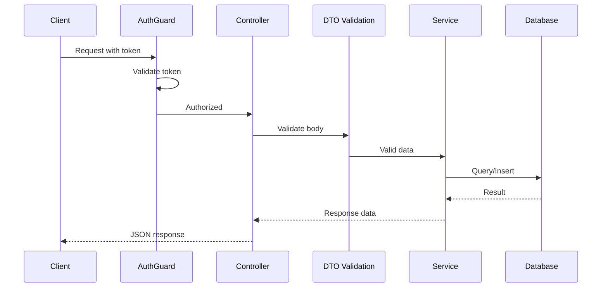

# T34: Dados e Autenticação no Nest.js

DTOs são como comandas de pedido que garantem que o garçom escreve exatamente o que a cozinha entende. Guards são o segurança conferindo identidade na porta. Junto com a integração com banco, eles formam a camada de dados e segurança de uma aplicação Nest.js.
{: .lesson-intro }

## DTOs e Validação

Um Data Transfer Object define o formato esperado dos dados que chegam. Combinado com decoradores do class-validator, ele rejeita requisições inválidas automaticamente. Compare com a validação manual do T22 - o Nest.js cuida disso declarativamente.

```
// create-menu-item.dto.ts
import { IsString, IsNumber, Min, MaxLength } from "class-validator";

export class CreateMenuItemDto {
    @IsString()
    @MaxLength(100)
    name: string;

    @IsNumber()
    @Min(0)
    price: number;

    @IsString()
    category: string;
}

// menu.controller.ts
import { Controller, Post, Body } from "@nestjs/common";

@Controller("menu")
export class MenuController {
    constructor(private readonly menuService: MenuService) {}

    @Post()
    create(@Body() dto: CreateMenuItemDto) {
        // dto is already validated - invalid requests never reach here
        return this.menuService.create(dto);
    }
}
```

## Integração com Banco

Nest.js funciona com o padrão de banco SQLite do T24, mas através de uma camada de repositório. O service interage com o banco, mantendo o acesso a dados separado do tratamento de HTTP.

## Guards de Autenticação

Um guard é uma classe que decide se uma requisição deve prosseguir. Ele confere tokens de autenticação antes do controller sequer ver a requisição. Aplique em rotas específicas ou controllers inteiros com o decorador `@UseGuards`.

```
// auth.guard.ts
import { CanActivate, ExecutionContext, Injectable, UnauthorizedException } from "@nestjs/common";

@Injectable()
export class AuthGuard implements CanActivate {
    canActivate(context: ExecutionContext): boolean {
        const request = context.switchToHttp().getRequest();
        const token = request.headers["authorization"];
        if (!token || !this.validateToken(token)) {
            throw new UnauthorizedException("Invalid or missing token");
        }
        return true;
    }

    private validateToken(token: string): boolean {
        // Token validation logic
        return token.startsWith("Bearer ");
    }
}

// Using the guard on a controller
import { Controller, Get, UseGuards } from "@nestjs/common";

@Controller("admin/menu")
@UseGuards(AuthGuard)
export class AdminMenuController {
    constructor(private readonly menuService: MenuService) {}

    @Get()
    findAll() {
        return this.menuService.findAll();
    }
}
```



<div class="takeaways">
<h2>Pontos-chave</h2>
<ul>
<li>DTOs com decoradores do class-validator cuidam da validação declarativamente - sem checagens manuais</li>
<li>O padrão de repositório mantém o acesso ao banco nos services, separado dos controllers</li>
<li>Guards rodam antes dos controllers, impondo autenticação no nível do framework</li>
<li>Decoradores como @UseGuards e @Body conectam segurança e validação sem sujar a lógica</li>
</ul>
</div>
