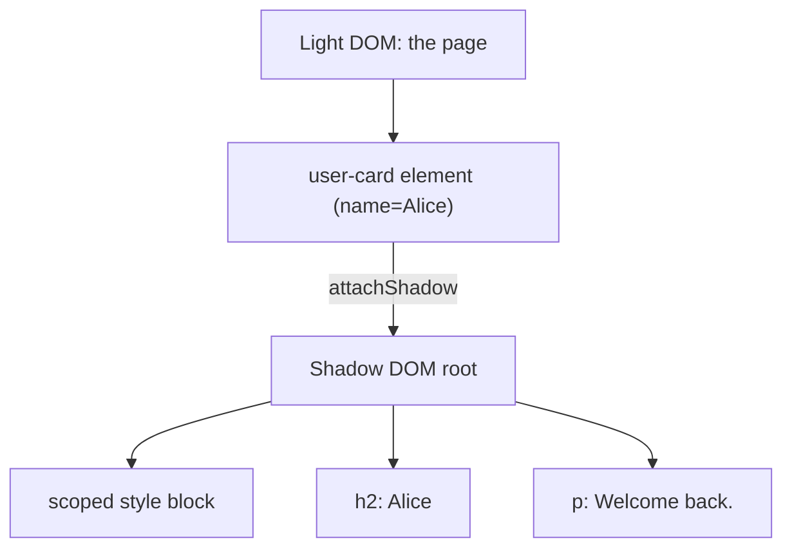

# T35: Web Components I - Custom Elements & Shadow DOM

もし自分のHTMLタグを発明できたら? `<user-card>`、`<rating-stars>`、`<search-box>`。Web Componentsはフレームワークもビルドステップもなしにそれを可能にします。2つの材料: Custom Elementsがタグを定義し、Shadow DOMが内部を封じて何も漏れ出ない/入らないようにする。
{: .lesson-intro }

## Custom Elements

Custom elementは `HTMLElement` を継承するクラスで、タグ名でブラウザに登録する。タグ名は*必ず*ハイフンを含まなければならない - ブラウザが組み込みタグと区別できるように。登録はページ内で永続。

```
class GreetingBox extends HTMLElement {
    constructor() {
        super();
        this.textContent = "Hello from a custom element!";
    }
}

customElements.define("greeting-box", GreetingBox);
```

これでこのタグがHTMLのどこでも動く:

```
<!-- 任意のページで -->
<greeting-box></greeting-box>
```

## 属性を読む

良いcustom elementは自分の属性を読んで自己構成する。組み込み要素がそうしている: ``、`<a href="...">`。あなたの要素もそうするべき。

```
class GreetingBox extends HTMLElement {
    connectedCallback() {
        const name = this.getAttribute("name") || "friend";
        this.textContent = `Hello, ${name}!`;
    }
}
customElements.define("greeting-box", GreetingBox);

// <greeting-box name="Alice"></greeting-box>
```

## Shadow DOM: 封じられた内部

Shadow DOMはあなたの要素にプライベートなDOMツリーをアタッチする。外のスタイルは中に届かず、中のスタイルは外に漏れない。これがなければ、ページのどこかの `h2 { color: red }` があなたのウィジェットを塗り替える。

```
class UserCard extends HTMLElement {
    connectedCallback() {
        const root = this.attachShadow({ mode: "open" });
        const name = this.getAttribute("name") || "Anonymous";
        root.innerHTML = `
            <style>
                :host { display: inline-block; padding: 1rem;
                       border: 1px solid #ddd; border-radius: 8px; }
                h2 { margin: 0; font-size: 1rem; color: #333; }
                p  { margin: 0.25rem 0 0; color: #666; }
            </style>
            <h2>${name}</h2>
            <p>Welcome back.</p>
        `;
    }
}
customElements.define("user-card", UserCard);
```



## :host と ::part

シャドウツリー内では、`:host` セレクタが要素自身を外から見るスタイルを当てる。特定のパーツを外からスタイリングさせたい場合は `part="..."` で公開し、利用側は `::part()` で指定する。

```
<style>
    :host { display: block; }
    :host([featured]) { border-color: gold; }
    button { cursor: pointer; }
</style>
<button part="action">Click me</button>

/* 外のページCSSで */
user-card::part(action) { background: tomato; color: white; }
```

<div class="takeaways">
<h2>まとめ</h2>
<ul>
<li>HTMLElementを継承し、customElements.define("my-tag", Class)で登録 - タグ名にハイフン必須</li>
<li>getAttributeで属性を読み、HTMLから要素を構成する</li>
<li>Shadow DOMがあなたの内部マークアップとスタイルをページの残りから封じる</li>
<li>:hostで要素自身をスタイル、::partで外のCSSにスタイリングフックを公開</li>
<li>Web Componentsはどのフレームワークでも、なくても動く - プラットフォームネイティブ</li>
</ul>
</div>
