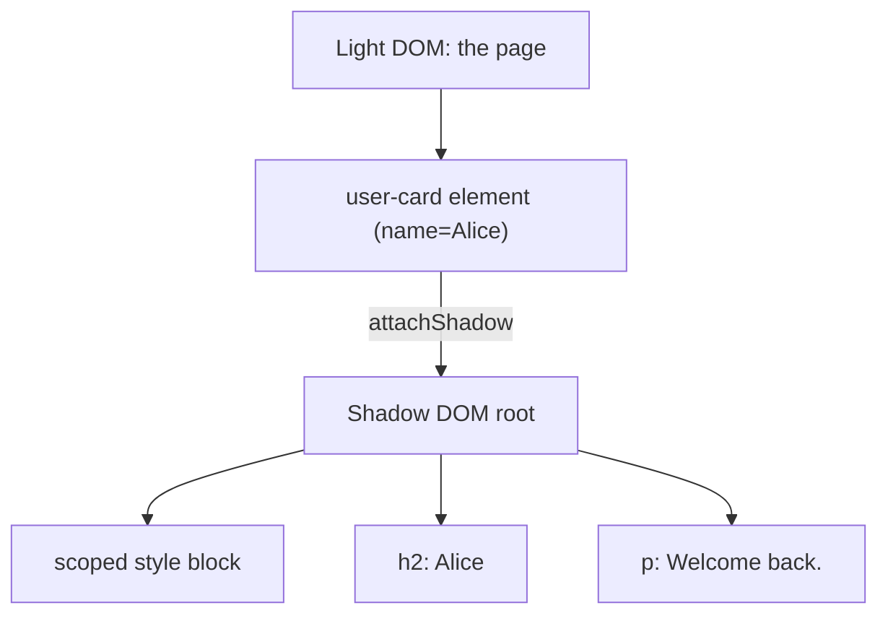

# T35: Web Components I - カスタム要素とShadow DOM

もし自分のHTMLタグを発明できたら? `<user-card>`、`<rating-stars>`、`<search-box>`。それがWeb Componentsです。フレームワークもビルドも無しで再利用可能なUIのレゴブロックをブラウザネイティブに作る方法。今日の2つの材料: カスタム要素がタグを定義し、Shadow DOMが中身を密閉して外に漏れないようにします。
{: .lesson-intro }

## カスタム要素

カスタム要素は`HTMLElement`を継承したクラスで、ブラウザにタグ名で登録します。タグ名には*必ず*ハイフンが必要で、これによりブラウザは組み込みタグと区別します。登録はページ上で永久的です。

```
class GreetingBox extends HTMLElement {
    constructor() {
        super();
        this.textContent = "Hello from a custom element!";
    }
}

customElements.define("greeting-box", GreetingBox);
```

これでこのタグがHTML内のどこでも使えます:

```
<!-- In any page -->
<greeting-box></greeting-box>
```

## 属性を読む

良いカスタム要素は自分の属性を読んで自己設定します。組み込み要素もそうです: ``、`<a href="...">`。あなたの要素も同様にすべきです。

```
class GreetingBox extends HTMLElement {
    connectedCallback() {
        const name = this.getAttribute("name") || "friend";
        this.textContent = `Hello, ${name}!`;
    }
}
customElements.define("greeting-box", GreetingBox);

// <greeting-box name="Alice"></greeting-box>
```

## Shadow DOM: 密閉された内部

Shadow DOMがないと、コンポーネントのHTMLとCSSはグローバルページに住みます。どこか別の場所の`h2 { color: red }`があなたの設計したウィジェットを赤く塗りかねません。Shadow DOMは要素にプライベートなツリーをアタッチします。外のスタイルは中に届かず、中のスタイルは外に漏れません。

```
class UserCard extends HTMLElement {
    connectedCallback() {
        const root = this.attachShadow({ mode: "open" });
        const name = this.getAttribute("name") || "Anonymous";
        root.innerHTML = `
            <style>
                :host { display: inline-block; padding: 1rem;
                       border: 1px solid #ddd; border-radius: 8px; }
                h2 { margin: 0; font-size: 1rem; color: #333; }
                p  { margin: 0.25rem 0 0; color: #666; }
            </style>
            <h2>${name}</h2>
            <p>Welcome back.</p>
        `;
    }
}
customElements.define("user-card", UserCard);
```



## :hostと::part

シャドウツリー内では、`:host`セレクタが要素自身を外から見るスタイルを当てます。特定のパーツを外からスタイリングさせたい場合は`part="..."`で公開し、利用側は`::part()`で指定します。

```
<style>
    :host { display: block; }
    :host([featured]) { border-color: gold; }
    button { cursor: pointer; }
</style>
<button part="action">Click me</button>

/* In the outer page CSS */
user-card::part(action) { background: tomato; color: white; }
```

<div class="takeaways">
<h2>まとめ</h2>
<ul>
<li>HTMLElementを継承し、customElements.define("my-tag", Class)で登録。タグにはハイフンが必須</li>
<li>getAttributeで属性を読み、HTMLから要素を設定する</li>
<li>Shadow DOMは内部のマークアップとスタイルをページの他の部分から密閉する</li>
<li>:hostで要素自体をスタイリング、::partで外部CSSに公開する</li>
<li>Web Componentsは任意のフレームワークで、またはフレームワーク無しで動く。プラットフォームネイティブ</li>
</ul>
</div>
