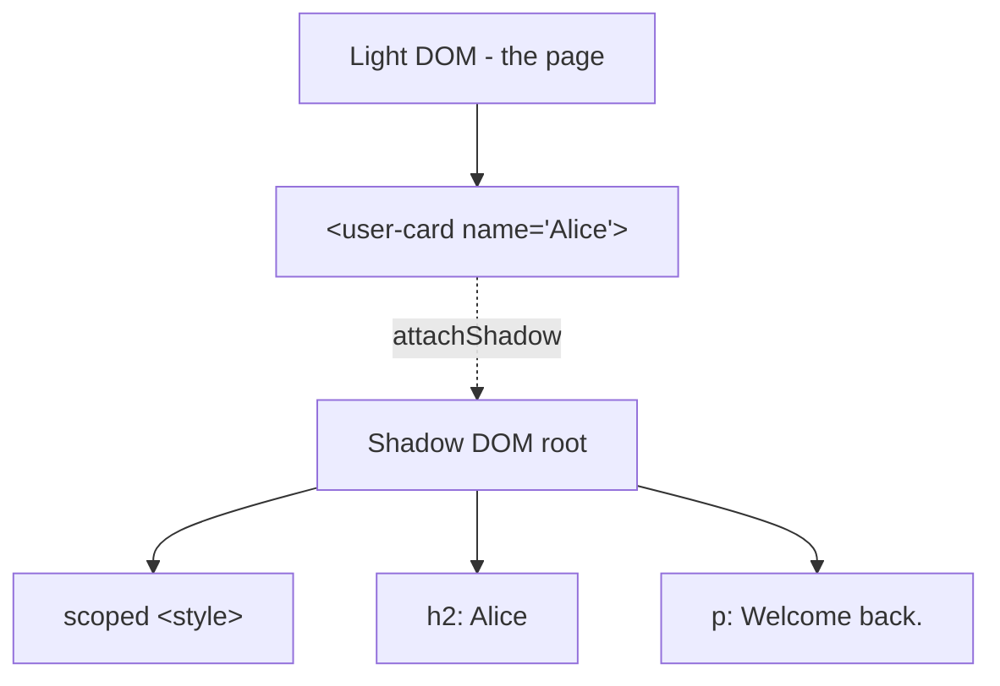

# T35: Web Components I - Custom Elements & Shadow DOM

What if you could invent your own HTML tag? `<user-card>`, `<rating-stars>`, `<search-box>`. That is Web Components: a browser-native way to build reusable UI Lego bricks with no framework, no build step. Two ingredients today: Custom Elements define the tag, Shadow DOM seals its insides so nothing leaks in or out.
{: .lesson-intro }

## Custom Elements

A custom element is a class that extends `HTMLElement`, registered with the browser under a tag name. The tag name *must* contain a hyphen so the browser can tell it apart from built-ins. Registration is permanent for the page.

```
class GreetingBox extends HTMLElement {
    constructor() {
        super();
        this.textContent = "Hello from a custom element!";
    }
}

customElements.define("greeting-box", GreetingBox);
```

Now this tag works anywhere in your HTML:

```
<!-- In any page -->
<greeting-box></greeting-box>
```

## Reading Attributes

A good custom element reads its own attributes to configure itself. Built-in elements do this: ``, `<a href="...">`. Your elements should too.

```
class GreetingBox extends HTMLElement {
    connectedCallback() {
        const name = this.getAttribute("name") || "friend";
        this.textContent = `Hello, ${name}!`;
    }
}
customElements.define("greeting-box", GreetingBox);

// <greeting-box name="Alice"></greeting-box>
```

## Shadow DOM: The Sealed Interior

Without Shadow DOM, your component's HTML and CSS live in the global page. A stray `h2 { color: red }` somewhere else could paint your carefully designed widget red. Shadow DOM attaches a private tree to your element. Outside styles cannot reach in, inside styles cannot leak out.

```
class UserCard extends HTMLElement {
    connectedCallback() {
        const root = this.attachShadow({ mode: "open" });
        const name = this.getAttribute("name") || "Anonymous";
        root.innerHTML = `
            <style>
                :host { display: inline-block; padding: 1rem;
                       border: 1px solid #ddd; border-radius: 8px; }
                h2 { margin: 0; font-size: 1rem; color: #333; }
                p  { margin: 0.25rem 0 0; color: #666; }
            </style>
            <h2>${name}</h2>
            <p>Welcome back.</p>
        `;
    }
}
customElements.define("user-card", UserCard);
```



## :host and ::part

Inside the shadow tree, the `:host` selector styles the custom element itself from the outside looking in. If you want to allow specific parts to be styled from outside, expose them with `part="..."` and consumers style via `::part()`.

```
<style>
    :host { display: block; }
    :host([featured]) { border-color: gold; }
    button { cursor: pointer; }
</style>
<button part="action">Click me</button>

/* In the outer page CSS */
user-card::part(action) { background: tomato; color: white; }
```

<div class="takeaways">
<h2>Key Takeaways</h2>
<ul>
<li>Extend HTMLElement, register with customElements.define("my-tag", Class) - tag must have a hyphen</li>
<li>Read attributes with getAttribute to configure the element from HTML</li>
<li>Shadow DOM seals your internal markup and styles from the rest of the page</li>
<li>Use :host to style the element itself, ::part to expose styling hooks to outside CSS</li>
<li>Web Components work in any framework or none - they are platform-native</li>
</ul>
</div>
