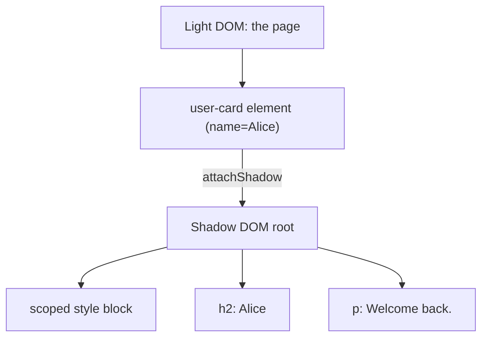

# T35: Web Components I - Custom Elements & Shadow DOM

E se você pudesse inventar sua própria tag HTML? `<user-card>`, `<rating-stars>`, `<search-box>`. Web Components deixam você fazer isso sem framework e sem passo de build. Dois ingredientes: Custom Elements definem a tag, Shadow DOM sela o interior para nada vazar nem entrar.
{: .lesson-intro }

## Custom Elements

Um custom element é uma classe que estende `HTMLElement`, registrada no navegador com um nome de tag. O nome da tag *precisa* ter um hífen para o navegador distinguir das nativas. Registro é permanente na página.

```
class GreetingBox extends HTMLElement {
    constructor() {
        super();
        this.textContent = "Hello from a custom element!";
    }
}

customElements.define("greeting-box", GreetingBox);
```

Agora essa tag funciona em qualquer lugar do HTML:

```
<!-- Em qualquer página -->
<greeting-box></greeting-box>
```

## Lendo Atributos

Um custom element bom lê seus próprios atributos para se configurar. Elementos nativos fazem isso: ``, `<a href="...">`. Os seus também devem.

```
class GreetingBox extends HTMLElement {
    connectedCallback() {
        const name = this.getAttribute("name") || "friend";
        this.textContent = `Hello, ${name}!`;
    }
}
customElements.define("greeting-box", GreetingBox);

// <greeting-box name="Alice"></greeting-box>
```

## Shadow DOM: O Interior Selado

Shadow DOM anexa uma árvore DOM privada ao seu elemento. Estilos de fora não entram, estilos de dentro não vazam. Sem isso, um `h2 { color: red }` perdido em qualquer lugar da página repintaria seu widget.

```
class UserCard extends HTMLElement {
    connectedCallback() {
        const root = this.attachShadow({ mode: "open" });
        const name = this.getAttribute("name") || "Anonymous";
        root.innerHTML = `
            <style>
                :host { display: inline-block; padding: 1rem;
                       border: 1px solid #ddd; border-radius: 8px; }
                h2 { margin: 0; font-size: 1rem; color: #333; }
                p  { margin: 0.25rem 0 0; color: #666; }
            </style>
            <h2>${name}</h2>
            <p>Welcome back.</p>
        `;
    }
}
customElements.define("user-card", UserCard);
```



## :host e ::part

Dentro da árvore shadow, o seletor `:host` estiliza o próprio custom element de fora para dentro. Se quiser deixar partes específicas serem estilizadas de fora, exponha-as com `part="..."` e consumidores estilizam via `::part()`.

```
<style>
    :host { display: block; }
    :host([featured]) { border-color: gold; }
    button { cursor: pointer; }
</style>
<button part="action">Click me</button>

/* No CSS da página externa */
user-card::part(action) { background: tomato; color: white; }
```

<div class="takeaways">
<h2>Pontos-chave</h2>
<ul>
<li>Estenda HTMLElement, registre com customElements.define("my-tag", Class) - tag precisa ter hífen</li>
<li>Leia atributos com getAttribute para configurar o elemento pelo HTML</li>
<li>Shadow DOM sela sua marcação e estilo internos do resto da página</li>
<li>Use :host para estilizar o próprio elemento, ::part para expor ganchos de estilo ao CSS externo</li>
<li>Web Components funcionam em qualquer framework ou nenhum - são nativos da plataforma</li>
</ul>
</div>
