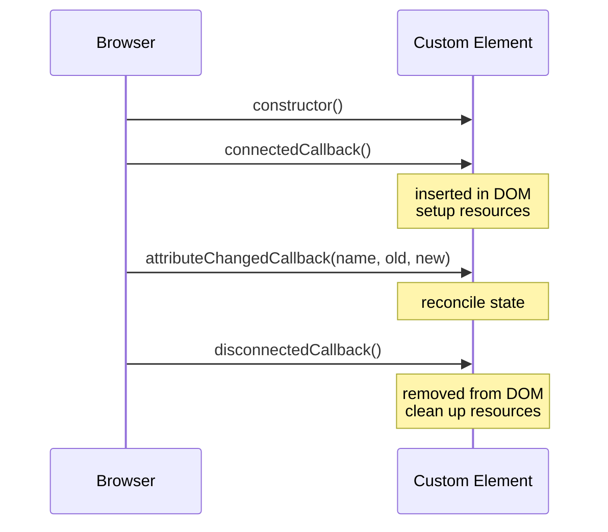

# T36: Web Components II - テンプレート、スロット、ライフサイクル、Lit

本物のコンポーネントにはあと3つ必要です。**テンプレート**は不活性なマークアップを必要になるまで舞台裏に置きます。**スロット**は親がReactの子要素のようにコンテンツを注入できるようにします。**ライフサイクル**コールバックは要素のライフステージです。誕生、挿入、属性変更、削除。これらを全て知ったら、Litが儀式を隠すエスプレッソマシンになります。
{: .lesson-intro }

## <template>要素

`<template>`はブラウザが解析するがレンダーしないマークアップを保持します。型として使い、文字列を組むのではなくそのコンテンツをシャドウルートにクローンします。

```
<template id="tpl-user-card">
    <style>
        :host { display: block; padding: 1rem; border: 1px solid #ddd; }
        h2 { margin: 0; }
    </style>
    <h2></h2>
    <p></p>
</template>

<script>
class UserCard extends HTMLElement {
    connectedCallback() {
        const tpl = document.getElementById("tpl-user-card");
        const root = this.attachShadow({ mode: "open" });
        root.appendChild(tpl.content.cloneNode(true));
        root.querySelector("h2").textContent = this.getAttribute("name");
        root.querySelector("p").textContent  = this.getAttribute("role");
    }
}
customElements.define("user-card", UserCard);
</script>
```

## スロット: コンテンツ投影

スロットはシャドウツリー内の穴で、親のライトDOMがそこに投影されます。ユーザーがあなたのタグの間に書いた内容は`<slot>`を置いた場所に現れます。名前付きスロットで複数の注入点を持てます。

```
// Inside the component's shadow root
<style>
    header { font-weight: bold; }
    footer { font-size: 0.85rem; color: #666; }
</style>
<header><slot name="title">Default title</slot></header>
<section><slot></slot></section>
<footer><slot name="footer"></slot></footer>

// Usage from the page
<fancy-card>
    <span slot="title">My Card</span>
    <p>Body content lands in the default slot.</p>
    <small slot="footer">Updated today</small>
</fancy-card>
```

## ライフサイクルコールバック

全てのカスタム要素は同じ5つのライフステージを持ちます。`connectedCallback`でセットアップし、`disconnectedCallback`で片付けます。属性変更には`attributeChangedCallback`で反応しますが、`observedAttributes`に列挙したものだけです。

```
class Timer extends HTMLElement {
    static observedAttributes = ["interval"];

    connectedCallback() {
        this._id = setInterval(() => this._tick(), this._ms());
        this._tick();
    }

    disconnectedCallback() {
        clearInterval(this._id);
    }

    attributeChangedCallback(name, oldValue, newValue) {
        if (name === "interval" && this._id) {
            clearInterval(this._id);
            this._id = setInterval(() => this._tick(), this._ms());
        }
    }

    _ms() { return Number(this.getAttribute("interval")) || 1000; }
    _tick() { this.textContent = new Date().toLocaleTimeString(); }
}
customElements.define("live-clock", Timer);
```



## Lit: シュガーレイヤー

素のWeb Componentsは動くが冗長です。**Lit**(5KB、Google発)はリアクティブプロパティ、タグ付きテンプレートレンダリング、スコープドスタイルで定型コードを削減します。Litコンポーネントは*ネイティブのカスタム要素そのもの*で、書くコードが少ないだけです。

```
import { LitElement, html, css } from "lit";

class UserCard extends LitElement {
    static properties = {
        name: { type: String },
        role: { type: String },
    };

    static styles = css`
        :host { display: block; padding: 1rem; border: 1px solid #ddd; }
        h2    { margin: 0; font-size: 1rem; }
        p     { margin: 0.25rem 0 0; color: #666; }
    `;

    render() {
        return html`
            <h2>${this.name}</h2>
            <p>${this.role}</p>
        `;
    }
}
customElements.define("user-card", UserCard);

// Usage
// <user-card name="Alice" role="Engineer"></user-card>
```

## よくある罠

- **コンストラクタでセットアップ**: 要素はまだDOMにない。connectedCallbackで行う。
- **observedAttributesを忘れる**: これ無しだとattributeChangedCallbackは発火しない。
- **リスナーの漏れ**: connectedCallbackで追加したものは全てdisconnectedCallbackで削除する。
- **Shadow DOMとフォーム**: シャドウルート内のフォーム入力は親フォームに自動参加しない。ElementInternals + static formAssociated = true を使う。

<div class="takeaways">
<h2>まとめ</h2>
<ul>
<li>&lt;template&gt;は不活性なマークアップを保持し、文字列を組むのではなくシャドウルートにクローンする</li>
<li>&lt;slot&gt;は親のコンテンツをコンポーネントに投影する。名前付きスロットで複数の注入点</li>
<li>5つのライフサイクルコールバック: constructor、connectedCallback、attributeChangedCallback、disconnectedCallback、adoptedCallback</li>
<li>observedAttributesがattributeChangedCallbackを発火させる属性を宣言する</li>
<li>LitはネイティブWeb Componentsの上の薄いシュガーレイヤー。同じ標準、はるかに少ない定型</li>
</ul>
</div>
