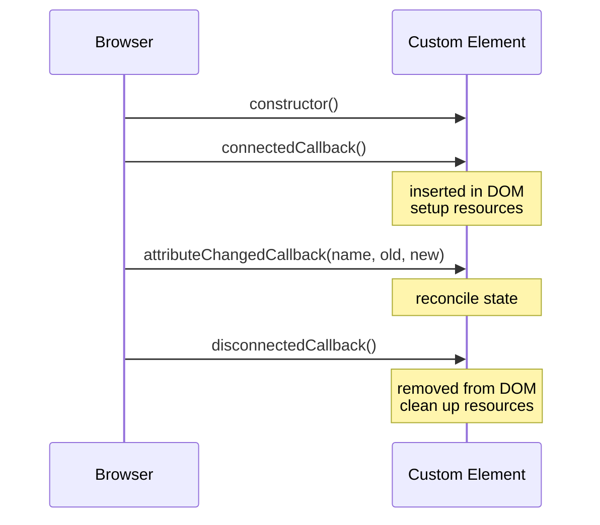

# T36: Web Components II - Templates, Slots, Lifecycle & Lit

A real component needs three more things. **Templates** keep inert markup off-stage until needed. **Slots** let parents inject content like React children. **Lifecycle** callbacks are the element's life stages - birth, insertion, attribute change, removal. Once you know all of this, Lit becomes the espresso machine that hides the ceremony. {.lesson-intro}

## The <template> Element

A `<template>` holds markup that the browser parses but does not render. Use it as a mold: clone its content into a shadow root instead of building strings.

```
<template id="tpl-user-card">
    <style>
        :host { display: block; padding: 1rem; border: 1px solid #ddd; }
        h2 { margin: 0; }
    </style>
    <h2></h2>
    <p></p>
</template>

<script>
class UserCard extends HTMLElement {
    connectedCallback() {
        const tpl = document.getElementById("tpl-user-card");
        const root = this.attachShadow({ mode: "open" });
        root.appendChild(tpl.content.cloneNode(true));
        root.querySelector("h2").textContent = this.getAttribute("name");
        root.querySelector("p").textContent  = this.getAttribute("role");
    }
}
customElements.define("user-card", UserCard);
</script>
```

## Slots: Content Projection

A slot is a hole in your shadow tree where the parent's light DOM is projected. Anything the user puts between your tags shows up wherever you placed the `<slot>`. Named slots let you have multiple injection points.

```
// Inside the component's shadow root
<style>
    header { font-weight: bold; }
    footer { font-size: 0.85rem; color: #666; }
</style>
<header><slot name="title">Default title</slot></header>
<section><slot></slot></section>
<footer><slot name="footer"></slot></footer>

// Usage from the page
<fancy-card>
    <span slot="title">My Card</span>
    <p>Body content lands in the default slot.</p>
    <small slot="footer">Updated today</small>
</fancy-card>
```

## Lifecycle Callbacks

Every custom element has the same five life stages. Do setup in `connectedCallback`, tear it down in `disconnectedCallback`. React to attribute changes in `attributeChangedCallback` - but only for the attributes listed in `observedAttributes`.

```
class Timer extends HTMLElement {
    static observedAttributes = ["interval"];

    connectedCallback() {
        this._id = setInterval(() => this._tick(), this._ms());
        this._tick();
    }

    disconnectedCallback() {
        clearInterval(this._id);
    }

    attributeChangedCallback(name, oldValue, newValue) {
        if (name === "interval" && this._id) {
            clearInterval(this._id);
            this._id = setInterval(() => this._tick(), this._ms());
        }
    }

    _ms() { return Number(this.getAttribute("interval")) || 1000; }
    _tick() { this.textContent = new Date().toLocaleTimeString(); }
}
customElements.define("live-clock", Timer);
```



## Lit: The Sugar Layer

Vanilla Web Components work but are verbose. **Lit** (5KB, from Google) removes boilerplate with reactive properties, tagged-template rendering, and scoped styles. A Lit component *is* a native custom element - it just wrote less code to get there.

```
import { LitElement, html, css } from "lit";

class UserCard extends LitElement {
    static properties = {
        name: { type: String },
        role: { type: String },
    };

    static styles = css`
        :host { display: block; padding: 1rem; border: 1px solid #ddd; }
        h2    { margin: 0; font-size: 1rem; }
        p     { margin: 0.25rem 0 0; color: #666; }
    `;

    render() {
        return html`
            <h2>${this.name}</h2>
            <p>${this.role}</p>
        `;
    }
}
customElements.define("user-card", UserCard);

// Usage
// <user-card name="Alice" role="Engineer"></user-card>
```

## Common Footguns

- **Setup in constructor**: the element is not in the DOM yet. Do it in connectedCallback.
- **Forgetting observedAttributes**: attributeChangedCallback will not fire without it.
- **Leaking listeners**: everything added in connectedCallback must be removed in disconnectedCallback.
- **Shadow DOM and forms**: form inputs in a shadow root do not automatically participate in the parent form. Use ElementInternals + static formAssociated = true.

<div class="takeaways">
<h2>Key Takeaways</h2>
<ul>
<li>&lt;template&gt; holds inert markup you clone into shadow roots instead of building strings</li>
<li>&lt;slot&gt; projects parent content into your component. Named slots give multiple injection points</li>
<li>Five lifecycle callbacks: constructor, connectedCallback, attributeChangedCallback, disconnectedCallback, adoptedCallback</li>
<li>observedAttributes declares which attributes trigger attributeChangedCallback</li>
<li>Lit is a thin sugar layer over native Web Components. Same standards, much less boilerplate</li>
</ul>
</div>
