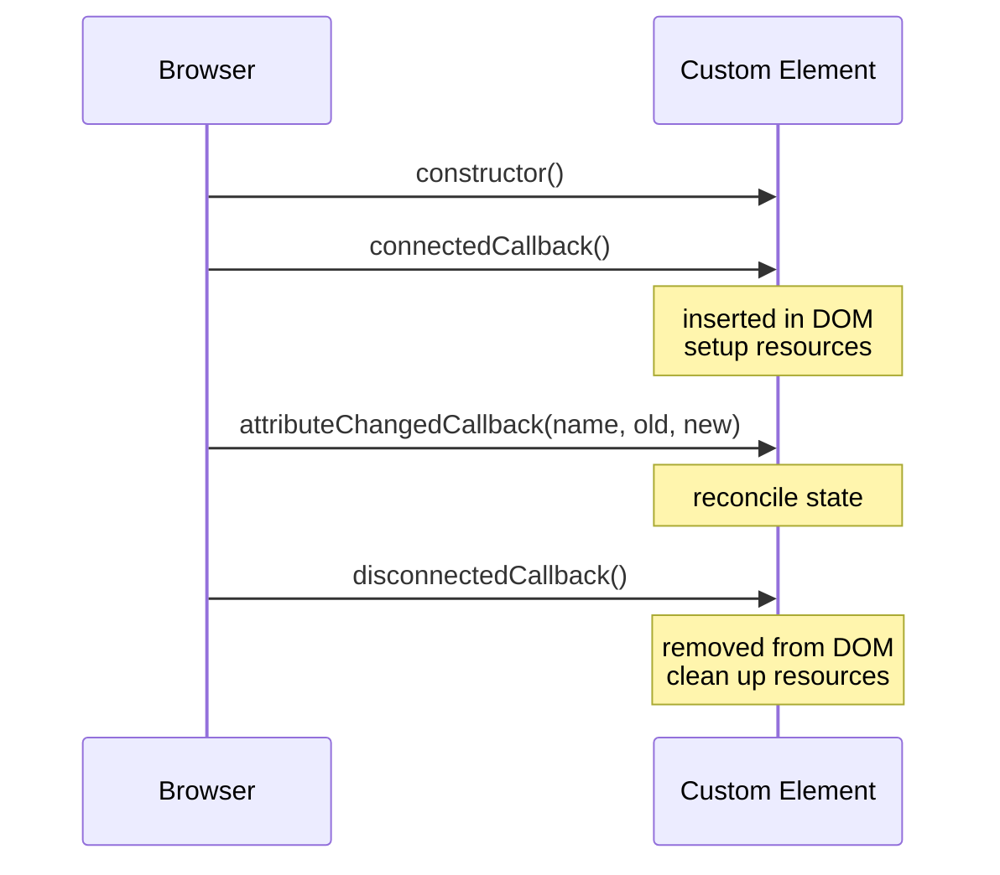

# T36: Web Components II - Templates, Slots, Ciclo de Vida e Lit

Um componente de verdade precisa de mais três coisas. **Templates** mantêm marcação inerte nos bastidores até precisar. **Slots** deixam pais injetarem conteúdo, como filhos no React. Callbacks de **ciclo de vida** são os estágios de vida do elemento - nascimento, inserção, mudança de atributo, remoção. Depois que você sabe tudo isso, o Lit vira a cafeteira que esconde a cerimônia.
{: .lesson-intro }

## O Elemento <template>

Um `<template>` guarda marcação que o navegador parseia mas não renderiza. Use como molde: clone o conteúdo dele para uma shadow root em vez de montar strings.

```
<template id="tpl-user-card">
    <style>
        :host { display: block; padding: 1rem; border: 1px solid #ddd; }
        h2 { margin: 0; }
    </style>
    <h2></h2>
    <p></p>
</template>

<script>
class UserCard extends HTMLElement {
    connectedCallback() {
        const tpl = document.getElementById("tpl-user-card");
        const root = this.attachShadow({ mode: "open" });
        root.appendChild(tpl.content.cloneNode(true));
        root.querySelector("h2").textContent = this.getAttribute("name");
        root.querySelector("p").textContent  = this.getAttribute("role");
    }
}
customElements.define("user-card", UserCard);
</script>
```

## Slots: Projeção de Conteúdo

Um slot é um buraco na sua shadow tree onde o light DOM do pai é projetado. Qualquer coisa que o usuário coloca entre suas tags aparece onde você colocou o `<slot>`. Slots nomeados permitem vários pontos de injeção.

```
// Inside the component's shadow root
<style>
    header { font-weight: bold; }
    footer { font-size: 0.85rem; color: #666; }
</style>
<header><slot name="title">Default title</slot></header>
<section><slot></slot></section>
<footer><slot name="footer"></slot></footer>

// Usage from the page
<fancy-card>
    <span slot="title">My Card</span>
    <p>Body content lands in the default slot.</p>
    <small slot="footer">Updated today</small>
</fancy-card>
```

## Callbacks de Ciclo de Vida

Todo custom element tem os mesmos cinco estágios de vida. Faça o setup em `connectedCallback`, desmonte em `disconnectedCallback`. Reaja a mudanças de atributo em `attributeChangedCallback` - mas só para os atributos listados em `observedAttributes`.

```
class Timer extends HTMLElement {
    static observedAttributes = ["interval"];

    connectedCallback() {
        this._id = setInterval(() => this._tick(), this._ms());
        this._tick();
    }

    disconnectedCallback() {
        clearInterval(this._id);
    }

    attributeChangedCallback(name, oldValue, newValue) {
        if (name === "interval" && this._id) {
            clearInterval(this._id);
            this._id = setInterval(() => this._tick(), this._ms());
        }
    }

    _ms() { return Number(this.getAttribute("interval")) || 1000; }
    _tick() { this.textContent = new Date().toLocaleTimeString(); }
}
customElements.define("live-clock", Timer);
```



## Lit: A Camada de Açúcar

Web Components puros funcionam mas são verbosos. O **Lit** (5KB, do Google) tira o boilerplate com propriedades reativas, renderização com tagged templates e estilos escopados. Um componente Lit *é* um custom element nativo - só escreveu menos código para chegar lá.

```
import { LitElement, html, css } from "lit";

class UserCard extends LitElement {
    static properties = {
        name: { type: String },
        role: { type: String },
    };

    static styles = css`
        :host { display: block; padding: 1rem; border: 1px solid #ddd; }
        h2    { margin: 0; font-size: 1rem; }
        p     { margin: 0.25rem 0 0; color: #666; }
    `;

    render() {
        return html`
            <h2>${this.name}</h2>
            <p>${this.role}</p>
        `;
    }
}
customElements.define("user-card", UserCard);

// Usage
// <user-card name="Alice" role="Engineer"></user-card>
```

## Armadilhas Comuns

- **Setup no constructor**: o elemento ainda não está no DOM. Faça no connectedCallback.
- **Esquecer observedAttributes**: attributeChangedCallback não dispara sem ele.
- **Listeners vazando**: tudo adicionado no connectedCallback tem que ser removido no disconnectedCallback.
- **Shadow DOM e formulários**: inputs de formulário numa shadow root não participam do formulário pai automaticamente. Use ElementInternals + static formAssociated = true.

<div class="takeaways">
<h2>Pontos-chave</h2>
<ul>
<li>&lt;template&gt; guarda marcação inerte que você clona para shadow roots em vez de montar strings</li>
<li>&lt;slot&gt; projeta conteúdo do pai para dentro do seu componente. Slots nomeados dão vários pontos de injeção</li>
<li>Cinco callbacks de ciclo de vida: constructor, connectedCallback, attributeChangedCallback, disconnectedCallback, adoptedCallback</li>
<li>observedAttributes declara quais atributos disparam attributeChangedCallback</li>
<li>Lit é uma camada fina de açúcar sobre Web Components nativos. Mesmo padrão, muito menos boilerplate</li>
</ul>
</div>
