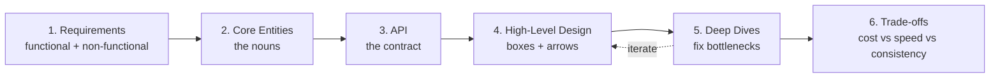
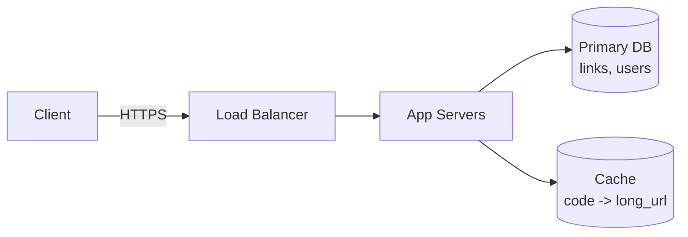

# T37: システム設計 - デリバリーフレームワーク

建築家はコンクリートを流す前に設計図を描きます。システム設計はソフトウェアの設計図を描くこと。何をするか、何でできているか、部品がどう組み合うか。面接や実プロジェクトで最も難しいのは、データベースやキャッシュを知ることではなく、質問の順序を知ることです。このレッスンでその順序を教えます。 {.lesson-intro}

## 6つのステップ

良いシステム設計の会話は、ほぼ順に6つのフェーズを進みます。厳守することで、形が見える前に詳細に溺れることを防ぎます。

1. **要件**(約5分) - システムが何をすべきか、どれくらいうまくやるか
2. **コアエンティティ**(約2分) - システムが扱う名詞
3. **API**(約5分) - ユーザーに見える契約
4. **高レベル設計**(約10-15分) - 要件を満たす箱と矢印
5. **ディープダイブ**(約10分) - ボトルネックを直し、厳しい目標を満たす
6. **トレードオフ** - コスト、速度、一貫性、複雑さの間の明示的な選択



## ステップ1: 要件

**機能要件**(ユーザーができること)と**非機能要件**(どれくらいうまく動くか)に分けます。非機能要件は定量化する。「低遅延」は役に立たず、「p99 < 200ms」は設計図です。

```
// Example: Design a URL shortener (tinyurl-style)

Functional:
- Users can submit a long URL and get back a short code
- Visiting /{code} redirects to the original URL
- Users can see click counts for their links

Non-functional:
- 100M new links / day, 10:1 read/write ratio
- Redirects at p99 < 100ms globally
- 99.99% availability for redirects
- Short codes must be unguessable
```

## ステップ2: コアエンティティ

名詞を挙げます。リストは小さく - 進めながら増やします。各エンティティは後にAPIとデータモデルの両方に現れます。

```
Link { id, short_code, long_url, owner_id, created_at, click_count }
User { id, email, password_hash }
```

## ステップ3: API

理由がなければRESTをデフォルトに。4-5エンドポイントで十分。リクエストボディのユーザーIDは信用しない。認証から取ります。

```
POST /links       { long_url } -> { short_code }
GET  /{code}                    -> 302 redirect
GET  /links        (auth)       -> list my links + counts
DELETE /links/{id} (auth)
```

## ステップ4: 高レベル設計

APIを実装する箱を描きます。シンプルに保つ。複雑さは、それが満たす要件を指し示せた時だけ正当化されます。



## ステップ5: ディープダイブ

非機能目標を順に歩き直します。各項目について、それを実現するコンポーネントを指すか、追加します。

- **グローバルp99 < 100ms**: 前段にCDN/エッジキャッシュ。リダイレクトはキャッシュルックアップに。
- **推測不可能なコード**: 安全な乱数から8文字base62、衝突時リトライ。自動増分IDは不可。
- **1日1億書き込み**: 書き込みスループットは約1200/秒。単一Postgresで捌ける。メトリクスがシャードを要求した時だけシャード。
- **クリック数**: リダイレクトごとにDB書き込みしない。キューに発行、非同期でバッチ書き込み。

## ステップ6: トレードオフ - 声に出して言う

全ての決定は1つのドアを閉じ、別のドアを開けます。選択を可視化しましょう。

- 非同期クリック数は**リアルタイム精度を失う**代わりに、**リダイレクト遅延を得る**
- CDNキャッシュは**削除時の古さ**と引き換えに、**エッジ速度を得る**
- ランダムコードは**少し空間を無駄にする**代わりに、**セキュリティを得る**

<div class="takeaways">
<h2>まとめ</h2>
<ul>
<li>6ステップを順に進む: 要件、エンティティ、API、高レベル、ディープダイブ、トレードオフ</li>
<li>非機能要件は定量化する。「速い」はノイズ、「p99 &lt; 200ms」は目標</li>
<li>機能要件を満たす最もシンプルな設計から始め、追加する全ての箱を正当化する</li>
<li>ディープダイブこそ本番 - 非機能リストを歩き、各ギャップを埋める</li>
<li>トレードオフは声に出す。全てのアーキテクチャ選択は1つのドアを閉じて別のドアを開ける</li>
</ul>
</div>
