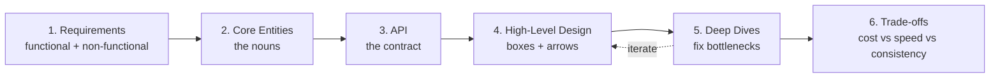
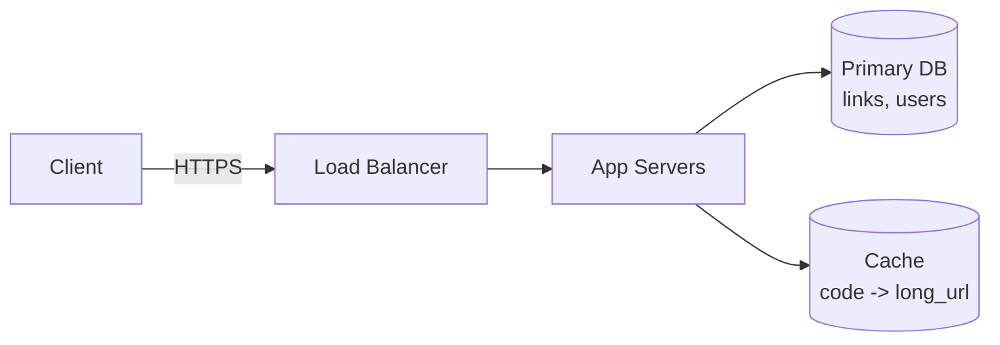

# T37: System Design - The Delivery Framework

Architects draw blueprints before anyone pours concrete. System design is drawing the blueprint for a piece of software: what it does, what it is made of, how the parts fit. In an interview or on a real project, the hardest part is not knowing databases or caches. It is knowing the order of questions to ask. This lesson teaches that order.
{: .lesson-intro }

## The Six Steps

A good system design conversation moves through six phases, roughly in order. Strictly following them keeps you from drowning in detail before you have a shape.

1. **Requirements** (~5 min) - what the system must do and how well
2. **Core Entities** (~2 min) - the nouns your system cares about
3. **API** (~5 min) - the contract users see
4. **High-Level Design** (~10-15 min) - boxes and arrows that serve the requirements
5. **Deep Dives** (~10 min) - fix the bottlenecks and meet the hard targets
6. **Trade-offs** - explicit choices between cost, speed, consistency, complexity



## Step 1: Requirements

Split into **functional** (what users can do) and **non-functional** (how well it must work). Quantify the non-functional targets - "low latency" is useless, "p99 < 200ms" is a blueprint.

```
// Example: Design a URL shortener (tinyurl-style)

Functional:
- Users can submit a long URL and get back a short code
- Visiting /{code} redirects to the original URL
- Users can see click counts for their links

Non-functional:
- 100M new links / day, 10:1 read/write ratio
- Redirects at p99 < 100ms globally
- 99.99% availability for redirects
- Short codes must be unguessable
```

## Step 2: Core Entities

Name the nouns. Keep the list small - you will grow it as you go. Each entity later shows up in both the API and the data model.

```
Link { id, short_code, long_url, owner_id, created_at, click_count }
User { id, email, password_hash }
```

## Step 3: API

Default to REST unless you have a reason not to. Four or five endpoints is plenty. Never trust user IDs from the request body - they come from authentication.

```
POST /links       { long_url } -> { short_code }
GET  /{code}                    -> 302 redirect
GET  /links        (auth)       -> list my links + counts
DELETE /links/{id} (auth)
```

## Step 4: High-Level Design

Draw the boxes that implement the API. Keep it simple. You earn complexity only by pointing at a requirement it satisfies.



## Step 5: Deep Dives

Walk back through the non-functional targets. For each, point at the component that delivers it or add one that does.

- **p99 < 100ms globally**: add a CDN / edge cache in front. Redirects become a cache lookup.
- **Unguessable codes**: 8-char base62 codes from a secure random, plus collision retry. Not an auto-increment ID.
- **100M writes / day**: write throughput is ~1200/sec. A single Postgres handles it; shard only if metrics say so.
- **Click counts**: do not write to DB on every redirect. Emit to a queue, batch into DB asynchronously.

## Step 6: Trade-offs - Say Them Out Loud

Every decision closes one door and opens another. Make the choices visible.

- Async click counts **lose real-time accuracy** to **gain** redirect latency
- CDN caches **stale-on-delete** briefly to **gain** edge speed
- Random codes **waste a little space** to **gain** security

<div class="takeaways">
<h2>Key Takeaways</h2>
<ul>
<li>Move through six steps in order: requirements, entities, API, high-level, deep dives, trade-offs</li>
<li>Quantify non-functional requirements. "Fast" is noise, "p99 &lt; 200ms" is a target</li>
<li>Start with the simplest design that meets functional requirements, then justify every box you add</li>
<li>Deep dives are where you earn your keep - walk the non-functional list and fix each gap</li>
<li>Say the trade-offs out loud. Every architecture choice closes one door to open another</li>
</ul>
</div>
