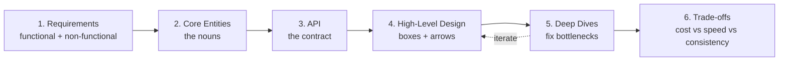
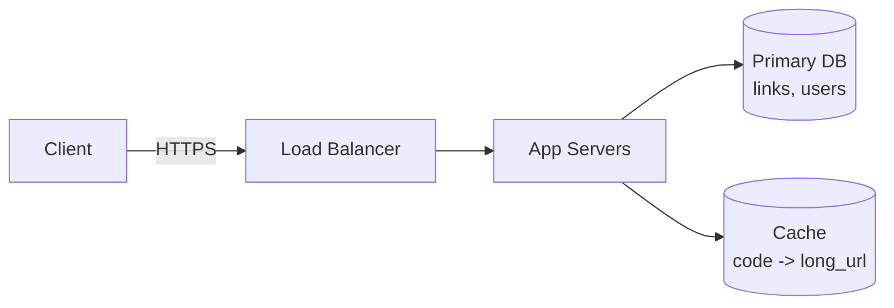

# T37: Design de Sistemas - O Framework de Entrega

Arquitetos desenham plantas antes que alguém derrame concreto. Design de sistemas é desenhar a planta de um software: o que faz, do que é feito, como as partes se encaixam. Numa entrevista ou num projeto real, a parte mais difícil não é saber de bancos de dados ou caches. É saber a ordem das perguntas a fazer. Esta aula ensina essa ordem.
{: .lesson-intro }

## Os Seis Passos

Uma boa conversa de design de sistemas percorre seis fases, mais ou menos nesta ordem. Seguir à risca te impede de afogar em detalhes antes de ter uma forma.

1. **Requisitos** (~5 min) - o que o sistema precisa fazer e quão bem
2. **Entidades Principais** (~2 min) - os substantivos que o sistema se importa
3. **API** (~5 min) - o contrato que os usuários veem
4. **Design de Alto Nível** (~10-15 min) - caixas e setas que atendem aos requisitos
5. **Deep Dives** (~10 min) - arruma os gargalos e bate nas metas difíceis
6. **Trade-offs** - escolhas explícitas entre custo, velocidade, consistência, complexidade



## Passo 1: Requisitos

Divida em **funcionais** (o que usuários podem fazer) e **não funcionais** (quão bem precisa funcionar). Quantifique as metas não funcionais - "baixa latência" é inútil, "p99 < 200ms" é uma planta.

```
// Example: Design a URL shortener (tinyurl-style)

Functional:
- Users can submit a long URL and get back a short code
- Visiting /{code} redirects to the original URL
- Users can see click counts for their links

Non-functional:
- 100M new links / day, 10:1 read/write ratio
- Redirects at p99 < 100ms globally
- 99.99% availability for redirects
- Short codes must be unguessable
```

## Passo 2: Entidades Principais

Nomeie os substantivos. Mantenha a lista curta - você cresce conforme avança. Cada entidade depois aparece tanto na API quanto no modelo de dados.

```
Link { id, short_code, long_url, owner_id, created_at, click_count }
User { id, email, password_hash }
```

## Passo 3: API

Vá de REST por padrão, a não ser que tenha um motivo para não. Quatro ou cinco endpoints bastam. Nunca confie no user ID vindo do body da requisição - ele vem da autenticação.

```
POST /links       { long_url } -> { short_code }
GET  /{code}                    -> 302 redirect
GET  /links        (auth)       -> list my links + counts
DELETE /links/{id} (auth)
```

## Passo 4: Design de Alto Nível

Desenhe as caixas que implementam a API. Mantenha simples. Você ganha o direito à complexidade só apontando para um requisito que ela satisfaz.



## Passo 5: Deep Dives

Percorra de volta as metas não funcionais. Para cada uma, aponte para o componente que entrega ou adicione um que entregue.

- **p99 < 100ms global**: adicione um CDN / cache de borda na frente. Redirects viram lookup no cache.
- **Códigos não adivinháveis**: códigos base62 de 8 caracteres a partir de random seguro, mais retry em colisão. Não ID autoincremento.
- **100M writes / dia**: throughput de escrita é ~1200/seg. Um único Postgres dá conta; só shard se métricas disserem.
- **Contagem de cliques**: não escreva no DB a cada redirect. Emita para uma fila, agrupe no DB assincronamente.

## Passo 6: Trade-offs - Diga em Voz Alta

Toda decisão fecha uma porta e abre outra. Torne as escolhas visíveis.

- Contagem assíncrona de cliques **perde precisão em tempo real** para **ganhar** latência de redirect
- Caches de CDN ficam **brevemente desatualizados na deleção** para **ganhar** velocidade na borda
- Códigos aleatórios **desperdiçam um pouco de espaço** para **ganhar** segurança

<div class="takeaways">
<h2>Pontos-chave</h2>
<ul>
<li>Passe pelos seis passos em ordem: requisitos, entidades, API, alto nível, deep dives, trade-offs</li>
<li>Quantifique requisitos não funcionais. "Rápido" é ruído, "p99 &lt; 200ms" é uma meta</li>
<li>Comece com o design mais simples que atende os requisitos funcionais, depois justifique cada caixa que adicionar</li>
<li>Deep dives é onde você mostra o que vale - percorra a lista não funcional e arrume cada buraco</li>
<li>Diga os trade-offs em voz alta. Toda escolha de arquitetura fecha uma porta para abrir outra</li>
</ul>
</div>
