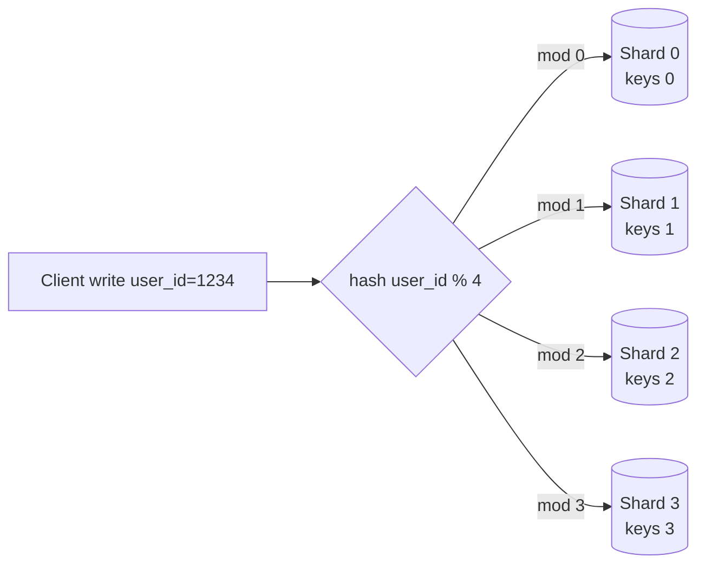

# T38: システム設計 - スケール、データベース、シャーディング

小さなサーバー1台でも、多くの人が思うより多くのトラフィックを捌けます。しかしある時点で単一サーバーは汗をかき、単一データベースは窒息し、仕事を複数マシンに分ける必要が出ます。スケーリングとは分割の技術です。まずコピーを追加(レプリカ)、次にデータ自体を分割(シャード)。コツは、数字が強いる時だけやることです。
{: .lesson-intro }

## 垂直 vs 水平

**垂直**スケーリング = より大きなマシンを買う。CPU増、RAM増。単純で、限界までは有効、天井がある。**水平**スケーリング = マシンを増やして負荷を共有。複雑、天井なし、現実のプロダクトが生き残る方法。

```
# Vertical: one strong server
[ 8 vCPU | 32 GB RAM ]  ->  [ 32 vCPU | 256 GB RAM ]

# Horizontal: many modest servers behind a load balancer
Client -> LB -> [ app1 ] [ app2 ] [ app3 ] ... [ appN ]
```

経験則: まず垂直。安くて簡単。垂直が限界、または冗長性が必要な時に水平へ。

## SQL vs NoSQL: データの形で選ぶ

**SQL**(Postgres、MySQL)はデータの形と関係が既知でトランザクションが必要な時に正解。**NoSQL**は多くの形をカバー: ドキュメント(MongoDB)はネストされたオブジェクト、キーバリュー(Redis、DynamoDB)はIDによる高速ルックアップ、ワイドカラム(Cassandra)は巨大なイベントストリーム。NoSQLは「スケール」ではなく具体的な理由で選ぶ。

```
// Orders, invoices, bookings     -> SQL
// User sessions, short-lived KV  -> Redis
// Logs, clicks, time series      -> Cassandra / Clickhouse
// Nested catalog documents       -> MongoDB
// Full-text search               -> Elasticsearch / Meilisearch
```

## レプリケーション: 読み込みスケールと安全性のコピー

大半のアプリは書き込みの10-100倍読みます。解決策: 1つの**プライマリ**が書き込みを処理し、複数の**レプリカ**が読み込みを提供。レプリカはプライマリ障害にも耐えます。

```
Writes --> [Primary]
              |--> [Replica 1] --> Reads
              |--> [Replica 2] --> Reads
              |--> [Replica 3] --> Reads
```

落とし穴: レプリケーションはデフォルトで非同期。書き込み直後のレプリカ読み込みは古いデータを返すかも。read-your-writesが必要なら、そのリードをプライマリにルーティング。

## シャーディング: 1つのDBでは足りない時

シャーディングは行を複数DBに分割します。各DBが1スライスを持ちます。**シャードキー**を選び、ハッシュしてルーティング。



シャーディングには高いコストがあります。シャードを跨ぐクエリはscatter-gatherになります。最も多いクエリに合うシャードキーを選びましょう。Twitter風アプリなら`user_id`でシャーディングして1ユーザーのタイムラインを1シャードに。

## コンシステントハッシュ: 痛みなく成長

単純なhash-modはシャードを追加すると壊れる。`hash % 4`が`hash % 5`になり、ほぼ全てのキーが家を変えます。**コンシステントハッシュ**はシャードをリングに配置。各キーはリング上の点に着地し、時計回りに最も近いシャードへ。シャード追加/削除は隣だけを動かします。

```
                 Shard A
                    *
      *                      *
  Shard D                  Shard B
      *                      *
                    *
                 Shard C

Key hashes to a point on the ring -> served by next shard clockwise.
Add Shard E between B and C -> only keys between B and E move.
```

## CAP定理: 2つ選ぶ(実際は2つのうち1つ)

分散システムでは一貫性(Consistency)、可用性(Availability)、分断耐性(Partition tolerance)を持てる。ネットワークは好むと好まざるとに関わらず分断するので、本当の選択は分断時の一貫性 vs 可用性です。

- **CPシステム**(銀行、在庫、決済): 不一致になるくらいなら書き込みを拒否。ユーザーは「再試行」を見るかも。
- **APシステム**(ソーシャルフィード、DM、キャッシュ): どちら側の書き込みも受け入れ、後で調整。ユーザーは少し古いデータを見る。

<div class="takeaways">
<h2>まとめ</h2>
<ul>
<li>まず垂直スケール、次に水平。現代のマシンは思うより強力</li>
<li>具体的なNoSQLの形が必要でない限りSQLを選ぶ。「スケール」だけでは理由にならない</li>
<li>レプリケーションは読みスケールとフェイルオーバーを提供。レプリカの短期の古さを受け入れるか、重要リードはプライマリへ</li>
<li>シャーディングは最後の手段。共通クエリに合うシャードキーを選び、他はscatter-gatherの痛みを覚悟</li>
<li>コンシステントハッシュはシャード変更を安くする。シャード数が変わるなら必ず使う</li>
<li>CAPは分断時に選択を強いる: 書き込み拒否(CP)か古い読み込み受容(AP)。どちらが必要か把握</li>
</ul>
</div>
