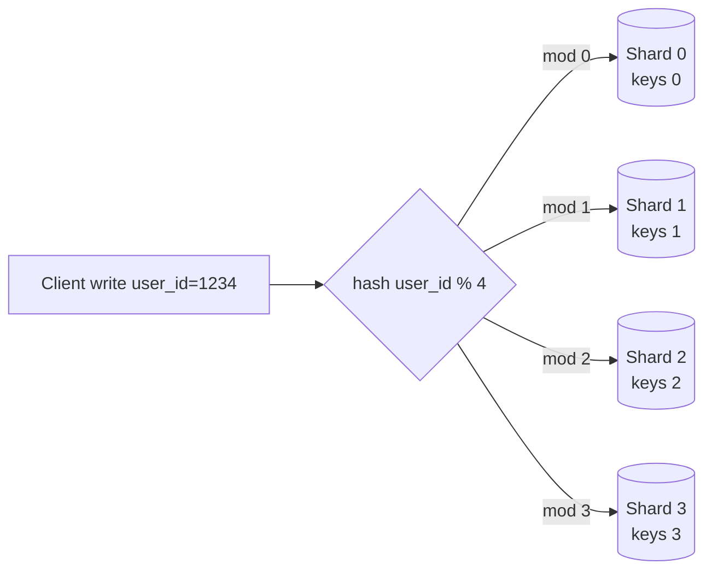

# T38: System Design - Scale, Databases, Sharding

One small server can handle more traffic than most people think. But at some point the single server sweats, the single database chokes, and you have to split work across machines. Scaling is the art of splitting - first by adding copies (replicas), then by splitting the data itself (shards). The trick is doing it only when the numbers force you to.
{: .lesson-intro }

## Vertical vs Horizontal

**Vertical** scaling = buy a bigger machine. More CPU, more RAM. Dead simple, works until it doesn't, has a ceiling. **Horizontal** scaling = add more machines and share the load. More complex, no ceiling, how real products survive traffic.

```
# Vertical: one strong server
[ 8 vCPU | 32 GB RAM ]  ->  [ 32 vCPU | 256 GB RAM ]

# Horizontal: many modest servers behind a load balancer
Client -> LB -> [ app1 ] [ app2 ] [ app3 ] ... [ appN ]
```

Rule of thumb: scale vertically first. It is cheaper and simpler. Scale horizontally when vertical hits its limit or when you need redundancy.

## SQL vs NoSQL: Pick For The Shape of Data

**SQL** (Postgres, MySQL) is right when your data has known shape and relationships, and you need transactions. **NoSQL** covers many shapes: document stores (MongoDB) for nested objects, key-value (Redis, DynamoDB) for fast lookups by id, wide-column (Cassandra) for huge event streams. Choose NoSQL for a specific reason, not "because scale".

```
// Orders, invoices, bookings     -> SQL
// User sessions, short-lived KV  -> Redis
// Logs, clicks, time series      -> Cassandra / Clickhouse
// Nested catalog documents       -> MongoDB
// Full-text search               -> Elasticsearch / Meilisearch
```

## Replication: Copies for Read Scale and Safety

Most apps read 10-100x more than they write. Solution: one **primary** handles writes, multiple **replicas** serve reads. Replicas also survive primary failure.

```
Writes --> [Primary]
              |--> [Replica 1] --> Reads
              |--> [Replica 2] --> Reads
              |--> [Replica 3] --> Reads
```

The catch: replication is asynchronous by default. A read on a replica right after a write may return stale data. If you need read-your-writes, route that read to the primary.

## Sharding: When One Database Is Not Enough

Sharding splits rows across many databases. Each database holds a slice. You pick a **shard key** and hash it to route rows.



Sharding has a steep cost: any query crossing shards must be scatter-gathered. Pick a shard key that matches your most common queries. For a Twitter-like app, shard by `user_id` so one user's timeline lives on one shard.

## Consistent Hashing: Growing Without Pain

Simple hash-mod breaks when you add a shard: `hash % 4` becomes `hash % 5`, and almost every key changes home. **Consistent hashing** places shards on a ring. Each key lands at a point on the ring and rolls clockwise to the nearest shard. Adding or removing a shard only moves the neighbors.

```
                 Shard A
                    *
      *                      *
  Shard D                  Shard B
      *                      *
                    *
                 Shard C

Key hashes to a point on the ring -> served by next shard clockwise.
Add Shard E between B and C -> only keys between B and E move.
```

## CAP Theorem: Pick Two (Really, Pick One of Two)

In a distributed system you can have Consistency, Availability, or Partition tolerance. Networks partition whether you like it or not, so the real choice is between consistency and availability during a partition.

- **CP systems** (banks, inventory, payments): refuse writes rather than disagree. Users may see "try again".
- **AP systems** (social feeds, DMs, caches): accept writes on either side, reconcile later. Users see slightly stale data.

<div class="takeaways">
<h2>Key Takeaways</h2>
<ul>
<li>Scale vertically first, horizontally second. A modern machine is more powerful than you think</li>
<li>Pick SQL unless you have a specific reason for a specific NoSQL shape. "Scale" alone is not a reason</li>
<li>Replication gives read scale and failover. Accept brief staleness on replicas or route critical reads to primary</li>
<li>Sharding is the last resort. Pick a shard key that matches your common queries, and expect scatter-gather pain for the rest</li>
<li>Consistent hashing makes shard changes cheap. Use it whenever the number of shards will ever change</li>
<li>CAP forces a choice during network partitions: refuse writes (CP) or accept stale reads (AP). Know which your system needs</li>
</ul>
</div>
